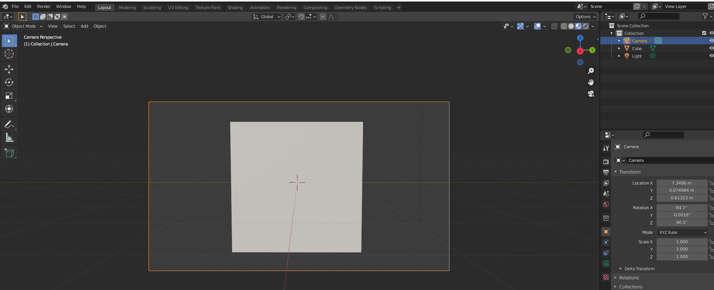

# DEV-05, Camera Setup & Moving Around
#### Tags: [Camera]

## How to look through the camera's perspective

+ type number pad 0

## How to do first person Mode
+ Shift + ~
+ you can also use arrow keys to move around
+ Combine the above with number pad 0 to have a moving camera

