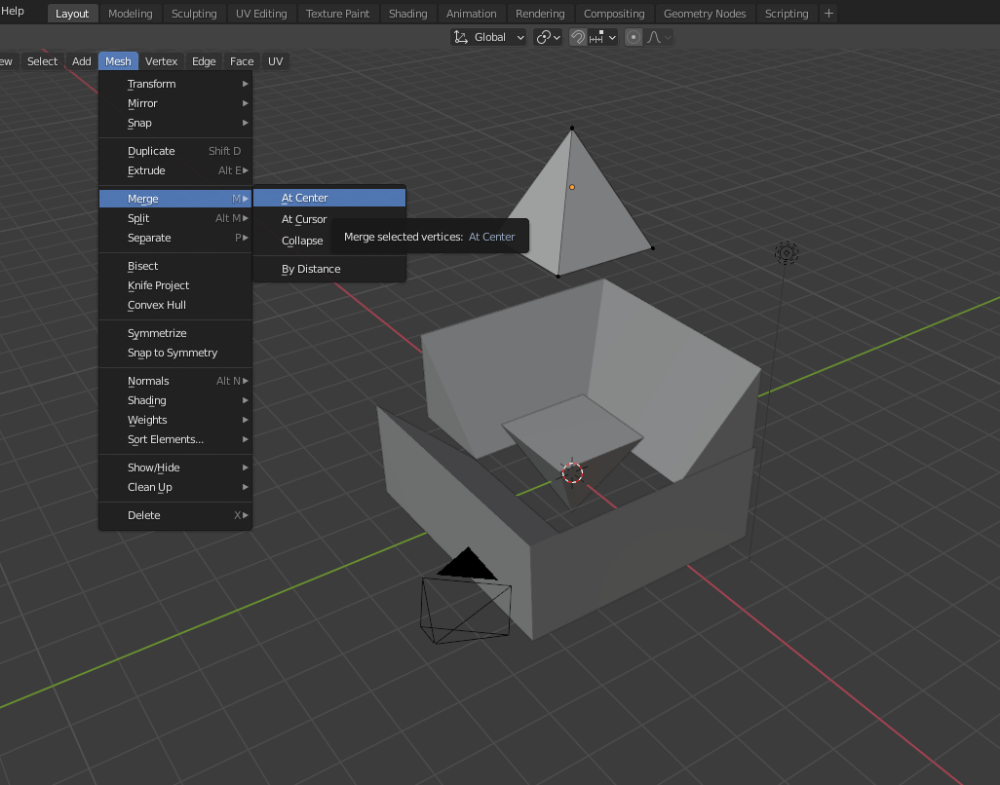
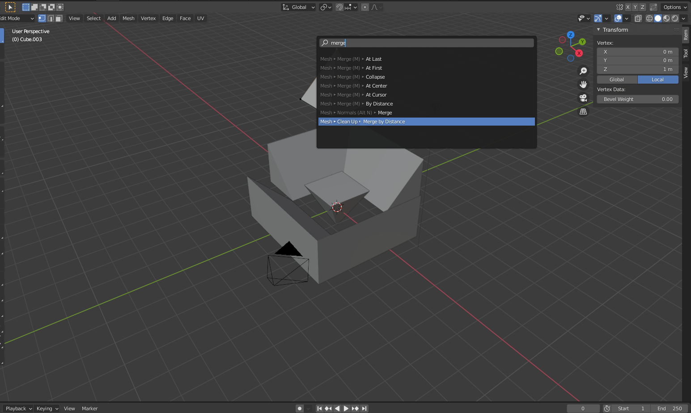
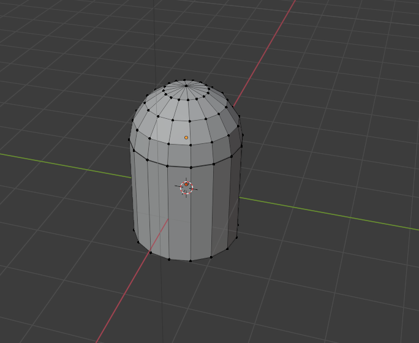

# DEV-11, Vertices, Edges, and Faces
#### Tags: [vertices, deges, faces]

## Filling
    Having your object selected then pressing the x key in edit mode you have alot of options

    You can fill in faces if you select two edges with shift then press f to fill in

# Merging

# Search

+ You can search with F3
+ You can find merge also by typing merge by distance

