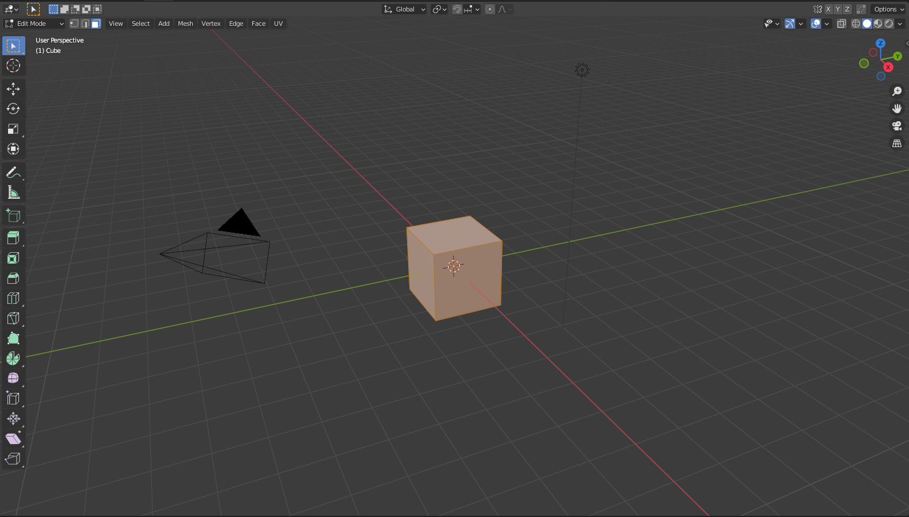
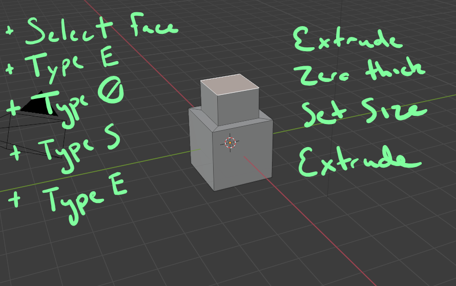
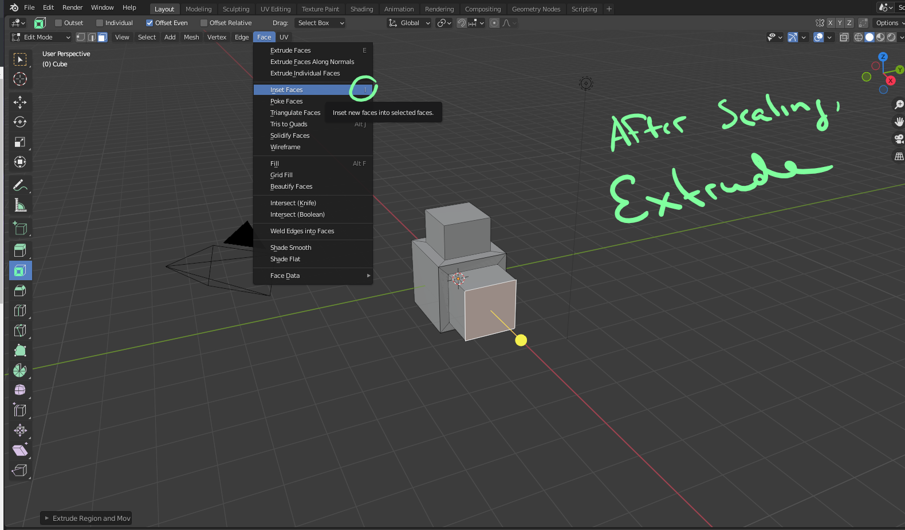
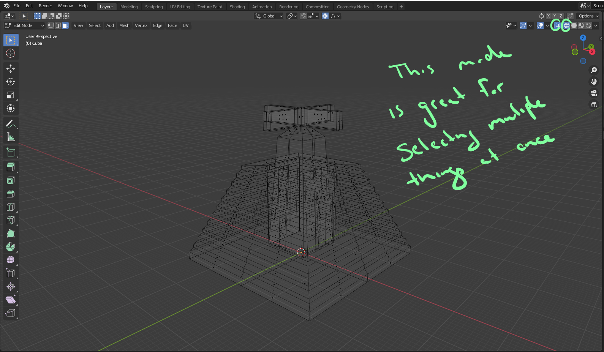
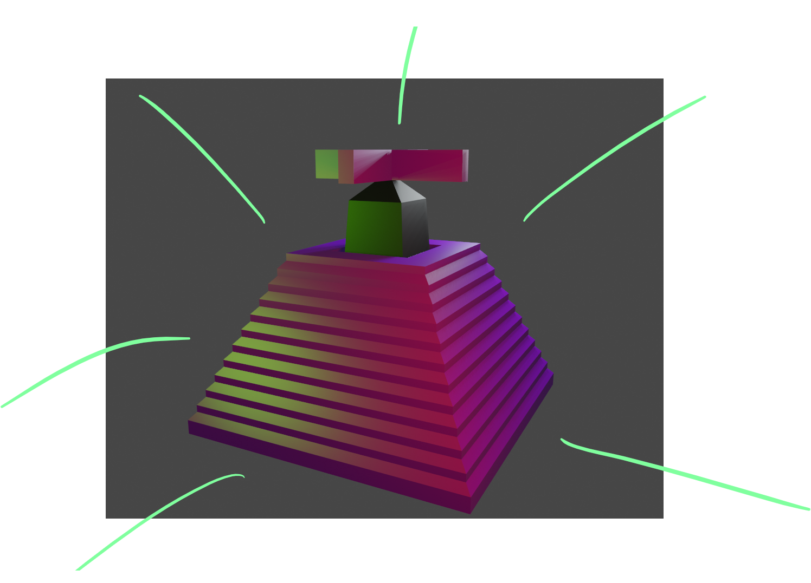

# DEV-16, InSetting
#### Tags: [insetting, extruding, scale]

## Mayan Structure
+ Make a low poly structure first
+ we are going to create it with the Inset tool

## How to use Insetting
+ it is a face operation so make sure you havbe face select on

    You can use key command I to start doing inset faces

## Outsetting
+ This is basically the opposite of insetting

## Result

