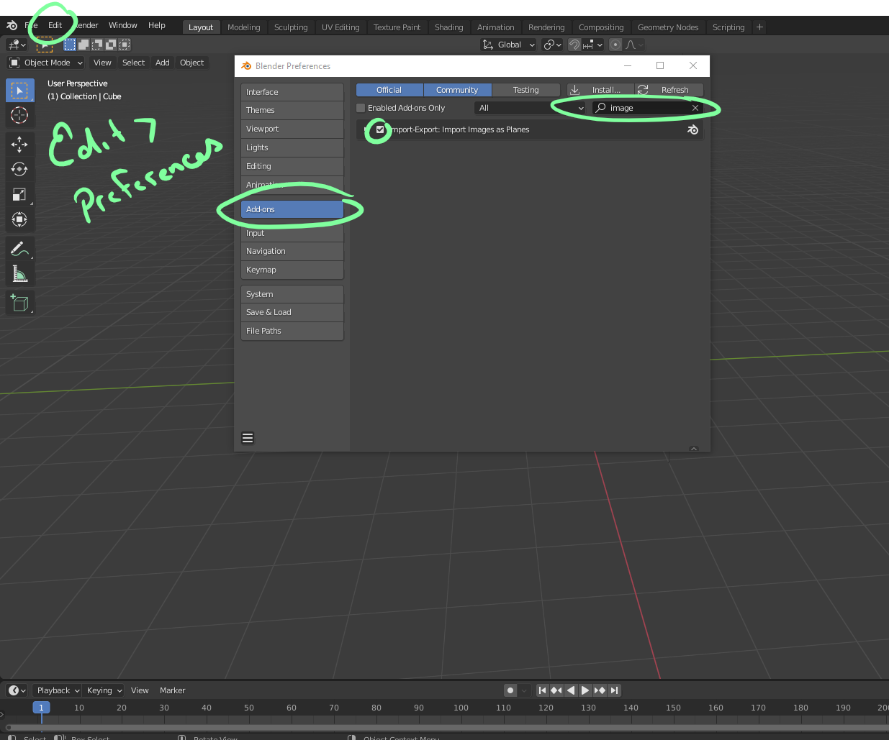
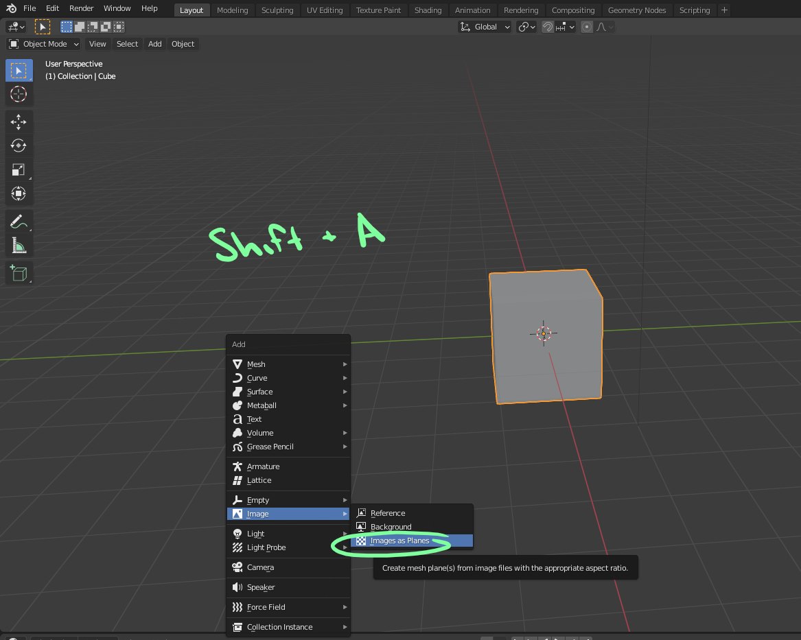
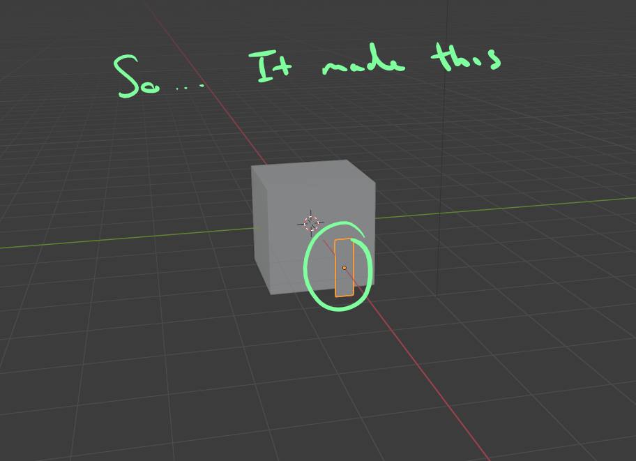
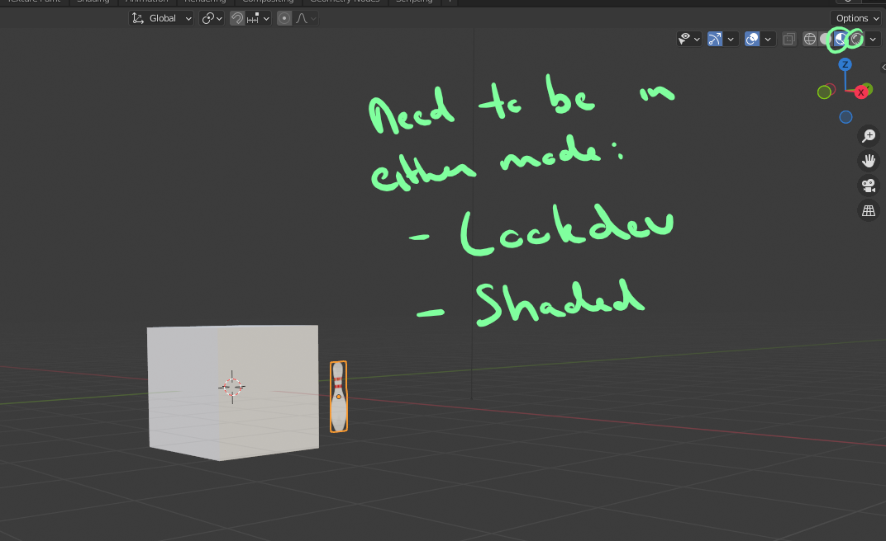
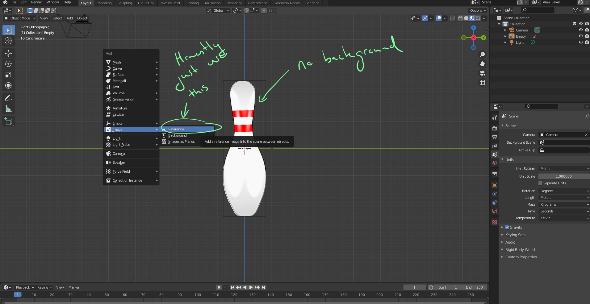
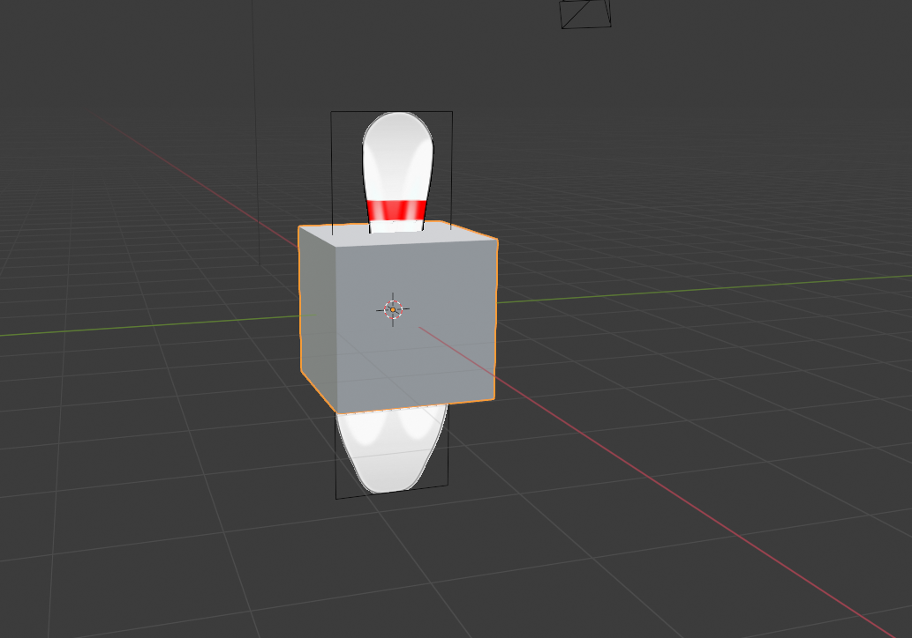

# DEV-23, Importing Reference Material
#### Tags: [importing images]

## Importing

    Edit > Preferences

## Visibility

    We want to be able to see our image even tho there is an object before it

