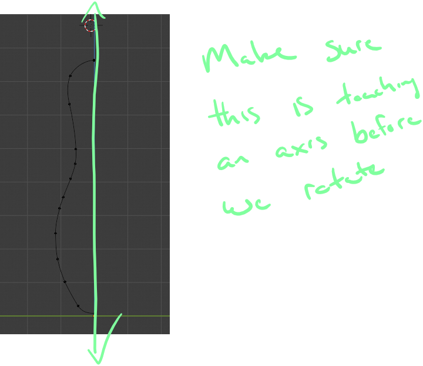
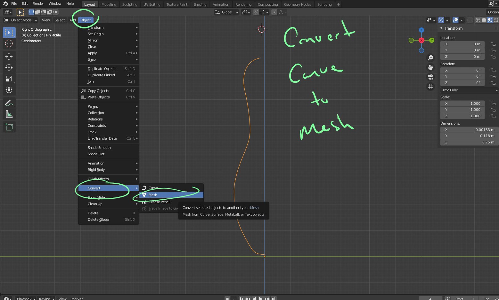
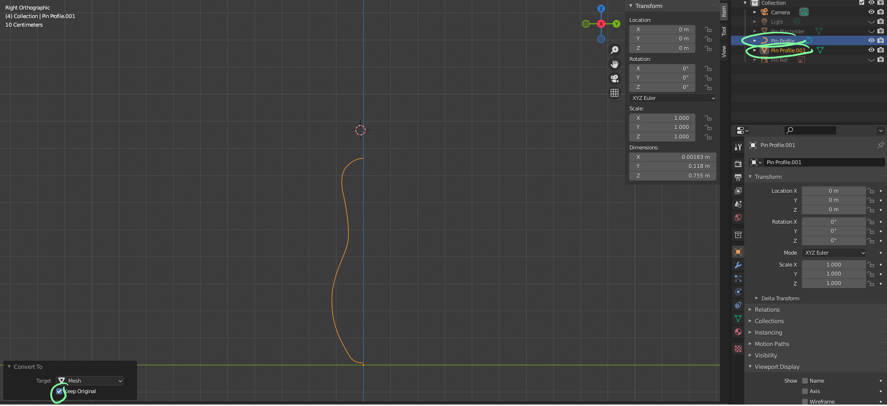

# DEV-26, Converting A curve to a mesh
#### Tags: [Curves, mesh]

## Converting a Curve

    Gonna learn about converting object data types
    Be sure to be in Object mode  

 

  

    Be sure to have the keep original box checked in the dropdown that appears in the bottom corner

   