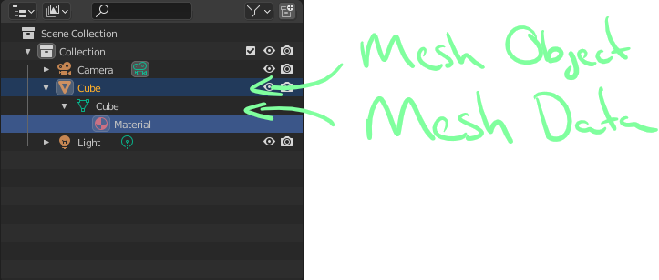
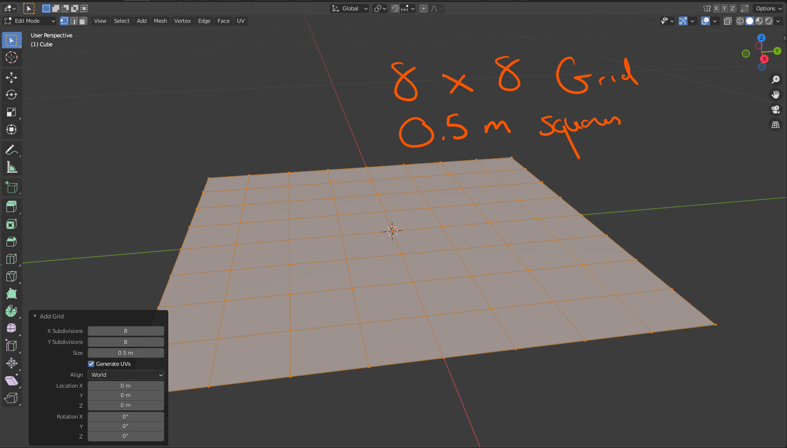
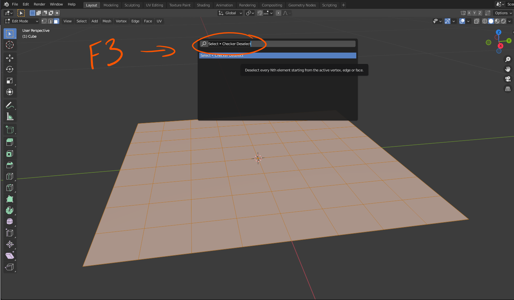
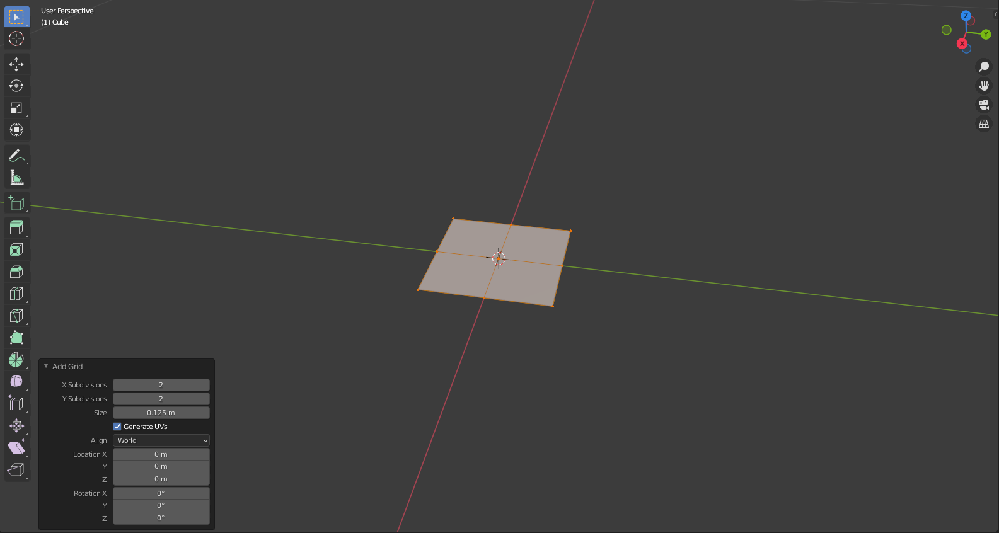
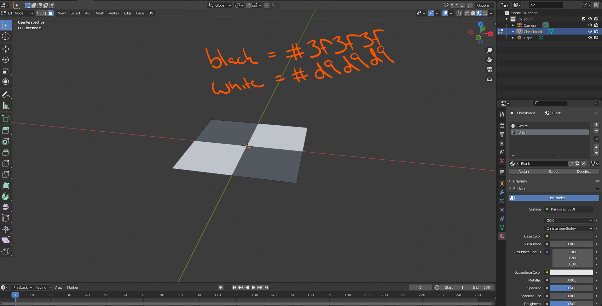
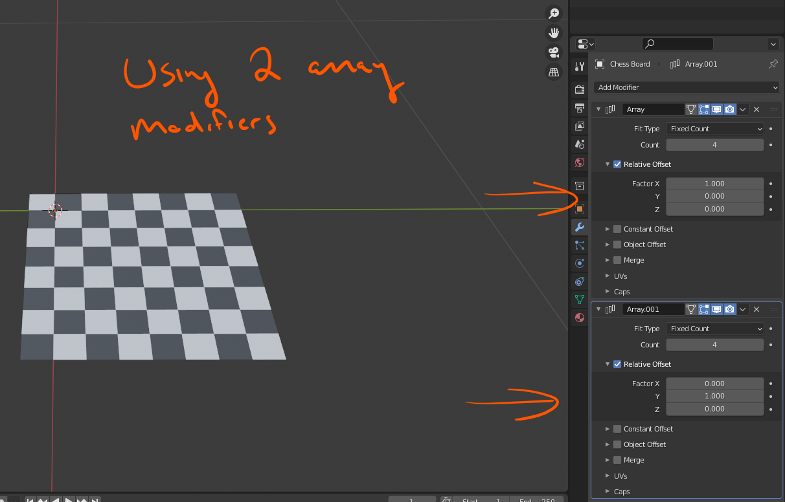

# DEV-33, Mesh Objects Vs Mesh Data
#### Tags: [Mesh, Array Modifier]

    In Edit mode, we are editing the Mesh Data
    In Object mode, we do object level Mesh Object operations

    F3 Checker Deselect

    Restarted

    Replicating

