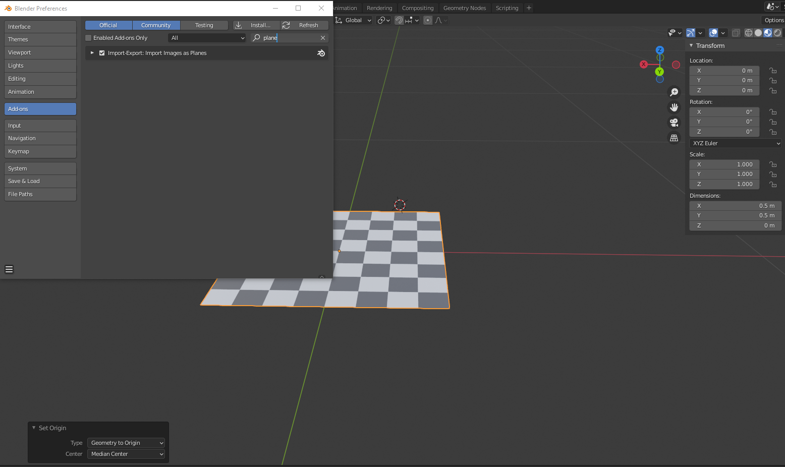
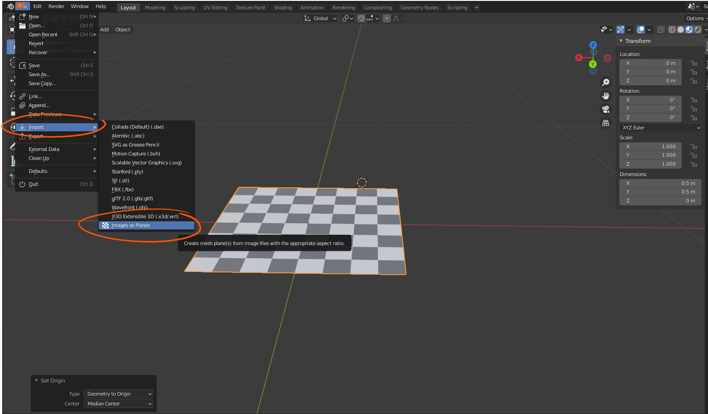
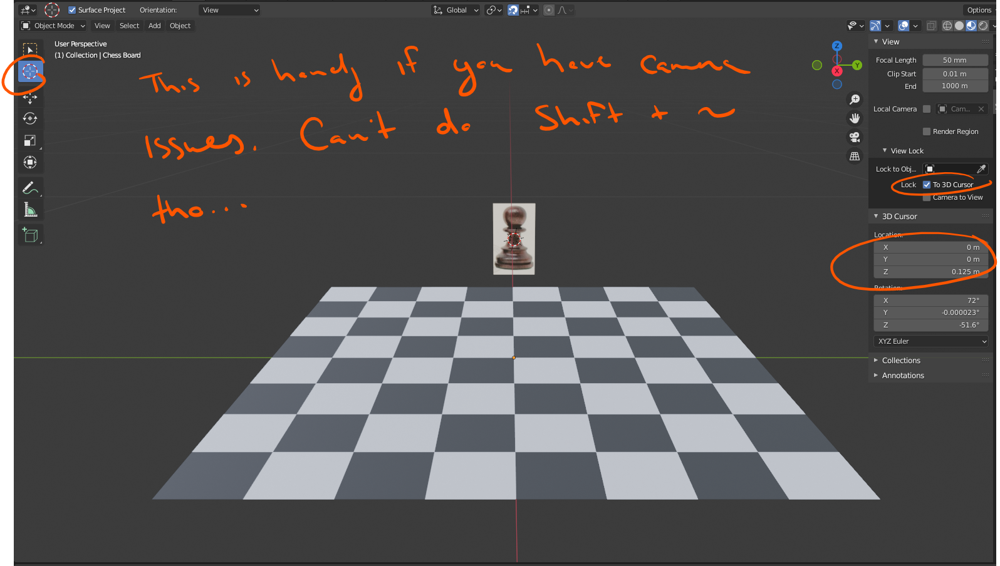
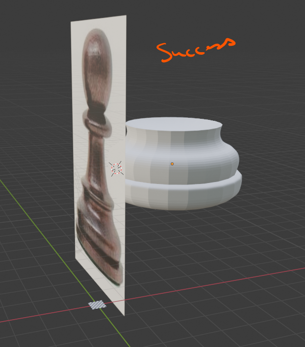

# DEV-35, Creating A Standard Asset
#### Tags: [images, imports, 3D Cursor, Camera, Centering Origin]

    Import image as a plane, but be sure to re add the add on

    We import our images as a plane so that we can do some scaling upon it. importing it raw as an empty strips us of any ability to do that.

    Needed to center the origin properly in order to do this

