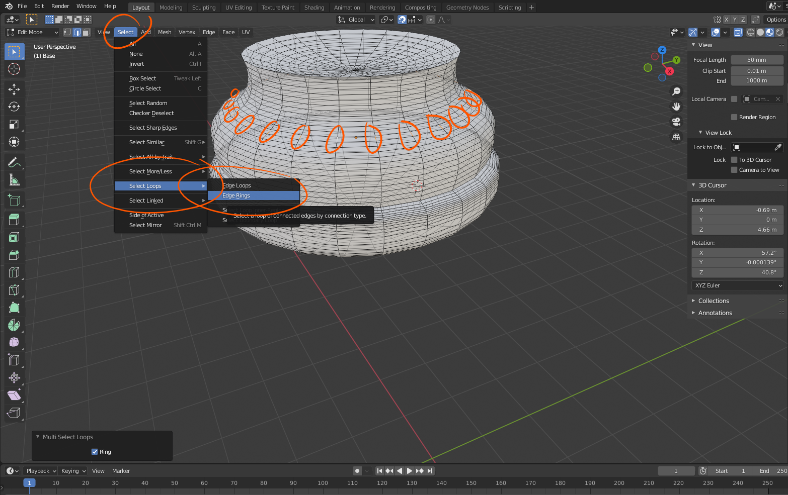
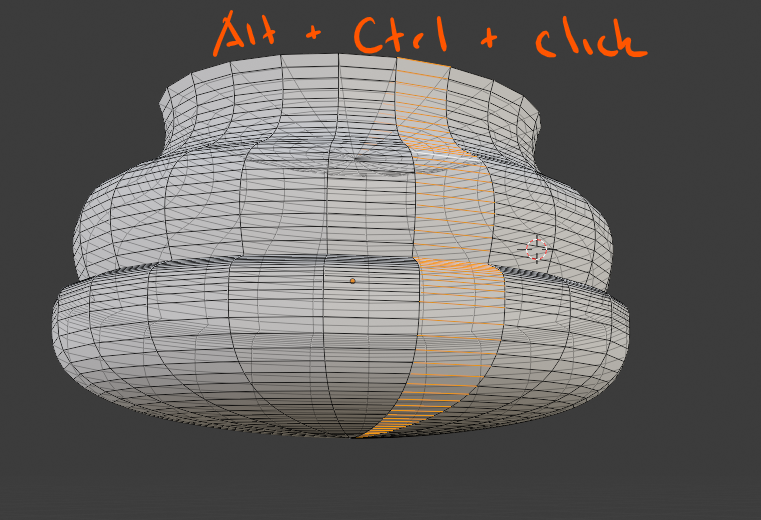
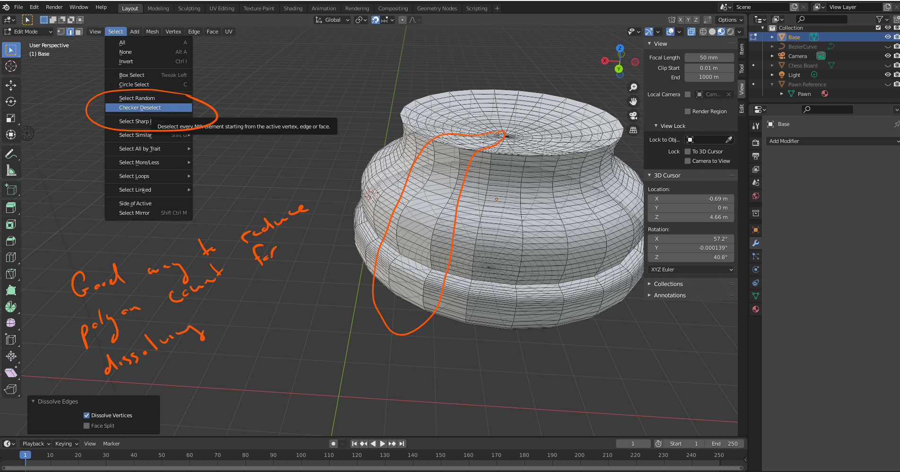

# DEV-37, Edge Rings
#### Tags: [Edge Rings, checker select]

    Selecting the edges around
    holding Alt and Ctrl may work as well

    You can checker deselect and then dissolve vertieces with right click

    With checker delsect you can set an offset which could be handy