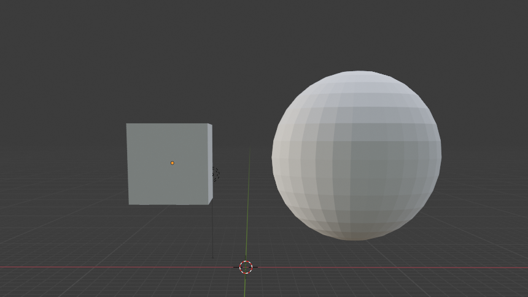
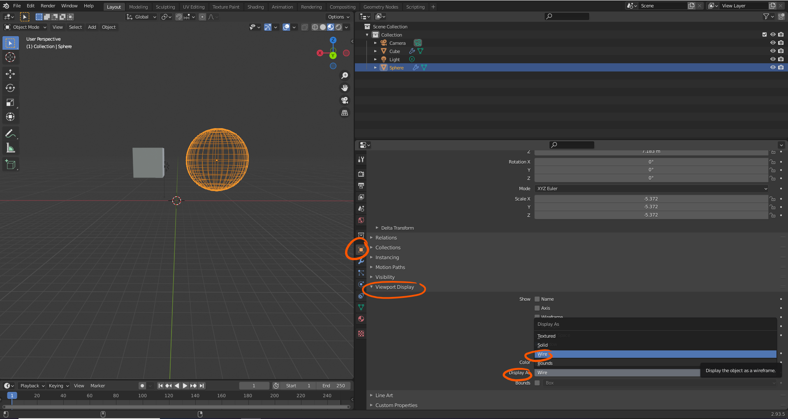
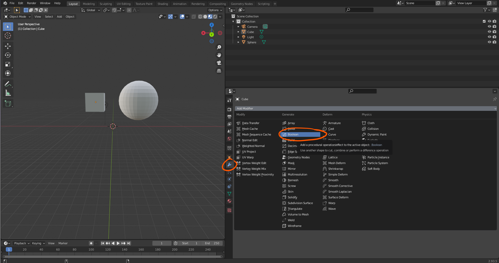
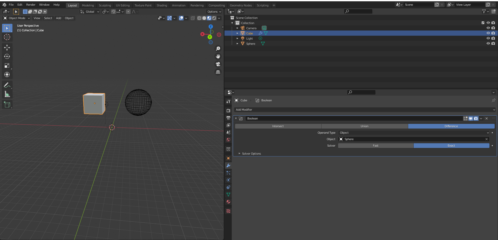
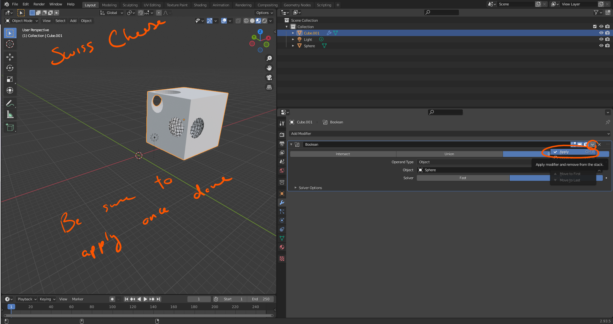
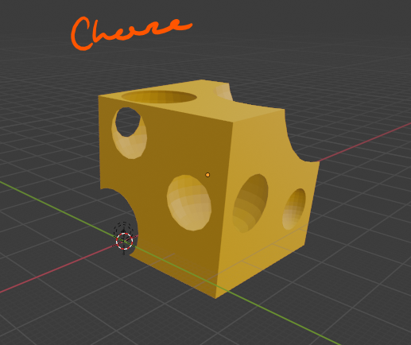

# DEV-40, Boolean Modifier
#### Tags: [Boolean Modifier, water tight, subtracting]

    We are gonna start out with the UV Spehere and a cube

    Also if you ever wanted to change how an object is displayed compared to others, this is how:

    This is great if you need help in intersecting two shapes.

    As for the boolean modifier, apply it to the object thats going to be the recipient of having it geometry modified by an outside shape. in that case that will be our cube.

    Read more about it, sometimes it does not work at times and its has to do with geometry being too different or not water tight3

    water tight mesh meaning: In other words, if you were to fill your mesh would water leak out of it (example the eyes, nose, mouth, are they closed off, or did you make a hole, and then just stick a sphear in there)
