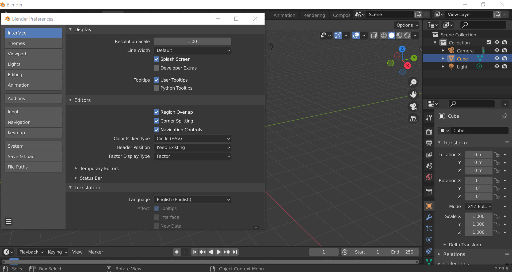
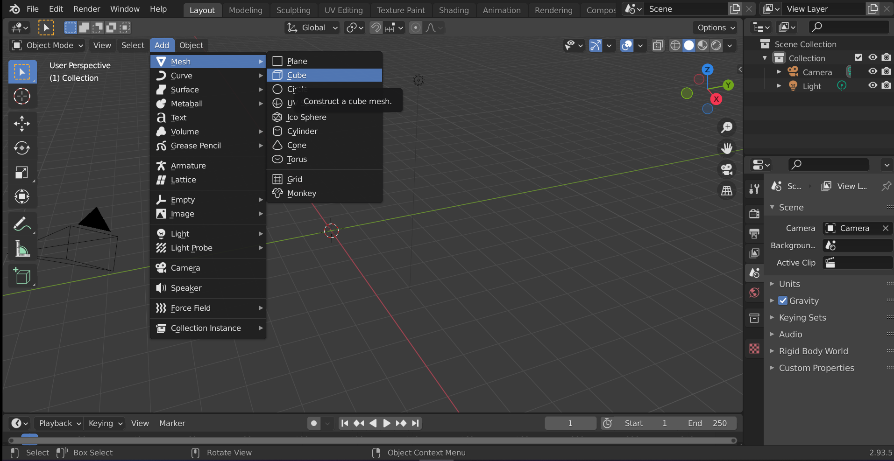
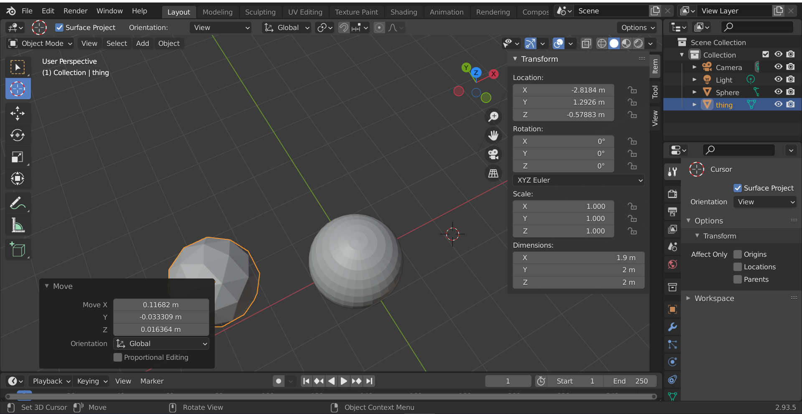
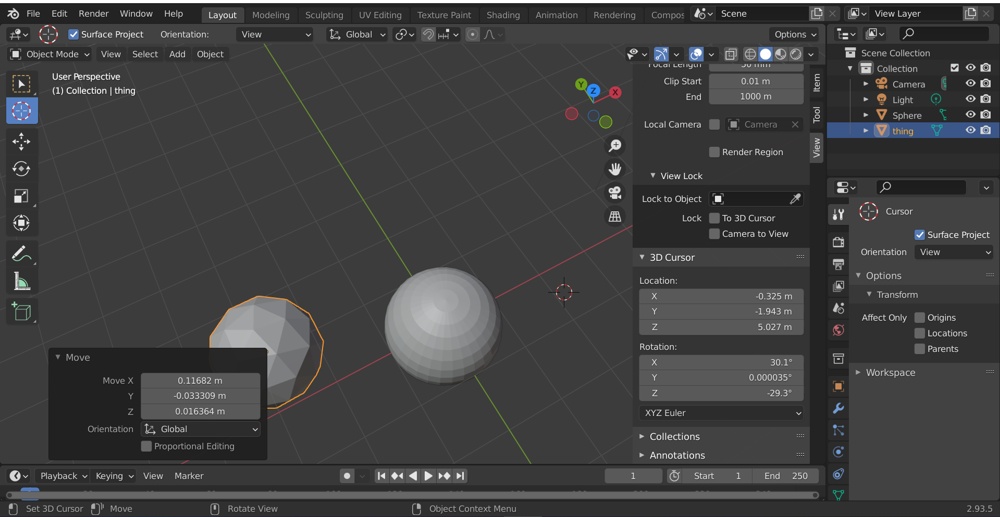

# DEV-01, Getting Started
#### Tags: [Settings, Adding]

## Preferences

`Edit > Preferences`

## To Delete

+ select the object and then press x

## To Add

+ select the object and then press x

+ Object will appear where ever the cursor is placed (white and red striped thing)
+ In our case, this cursor was is origin

## How to position the cursor more precisely

