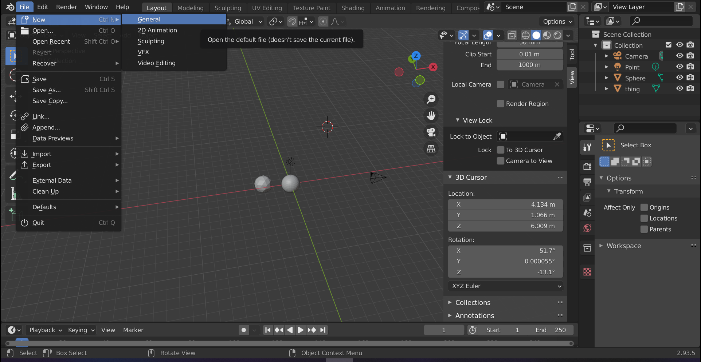
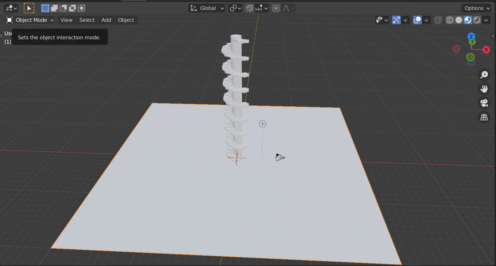

# DEV-02, HotKeys
#### Tags: [Move, Rotate, Scale, Dupulication]

## New File

## Toggleables

+ Left toolbar with `T`
+ Right toolbar with `N` (Where to find 3d cursor and stuffs)
+ Tab for Edit Mode

## Move
+ Ctrl + A to Apply things like rotation & scale so that its the new default state
+ G key you can Translate
+ S key you can Scale
+ R key you can rotate
+ Pressing G twice does things
+ Pressing R twice does things
+ X to lock into x axis and move along
+ Shift + X to move in axis but x
+ same works for Y and Z
+ you can also type the numbers themselves instead of dragging shit around

## Duplicate
+ Duplicate with Shift + D
+ Ctrl + M to make a collection (to put all our stairs in)

## Snapping
+ Use Shift + Tab to toggle snapping

## Creating
+ Shift + A

## Camera
+ type number pad 0 to see in the camera's perspective
+ type number pad 7 for top down along positive Z
+ type number pad 3 for top down along positive Y
+ type number pad . to have object neatly in frame

## Rendering
+ F12 to render

