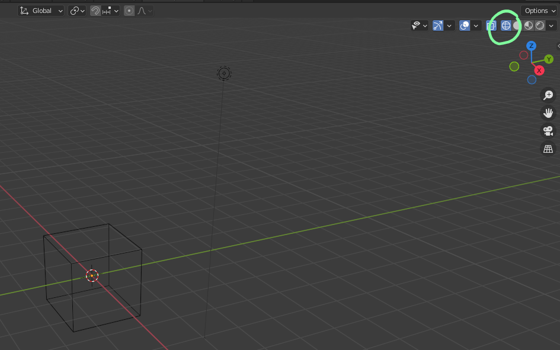
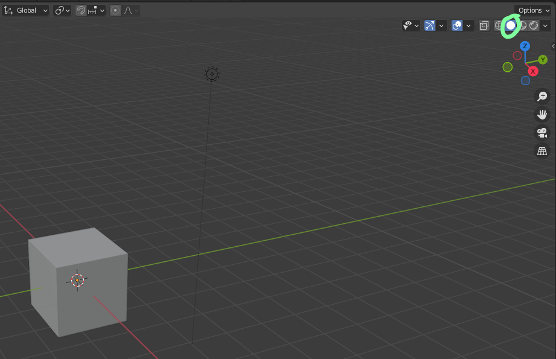
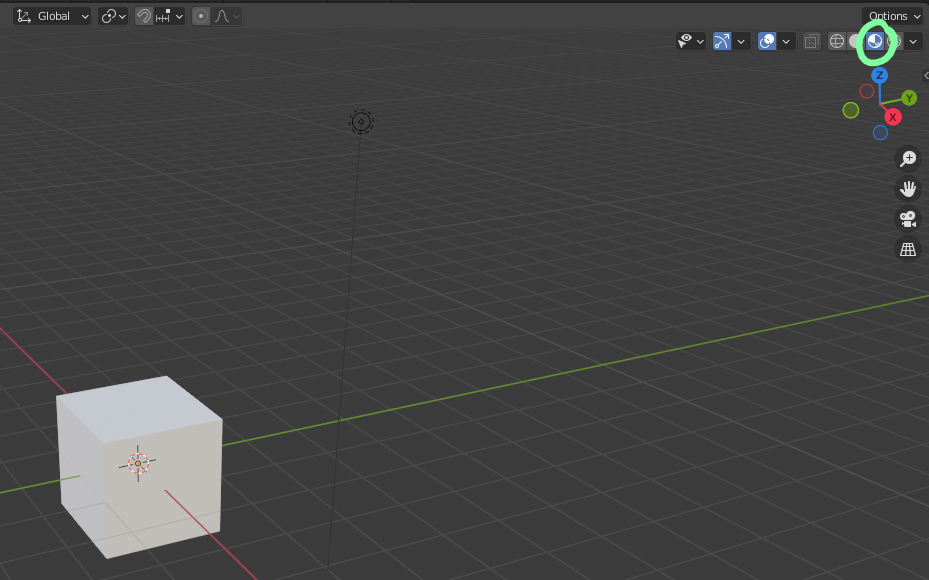
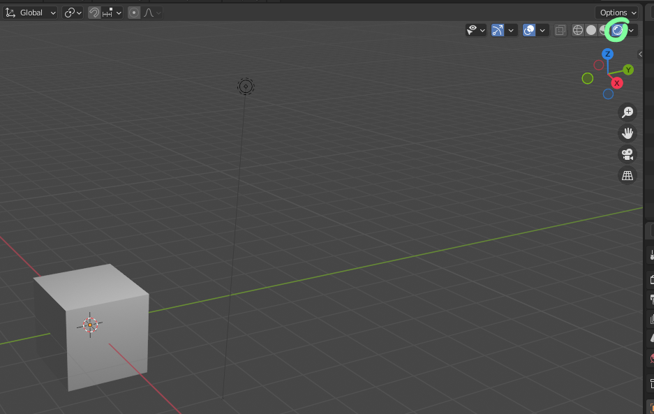
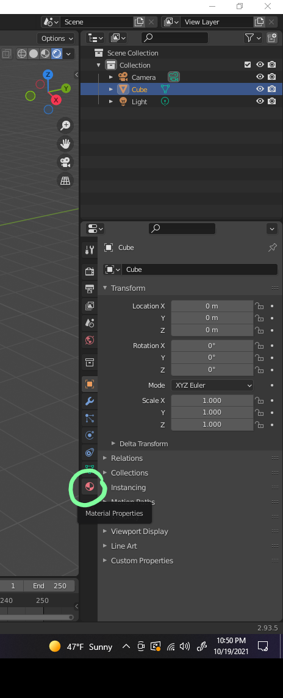
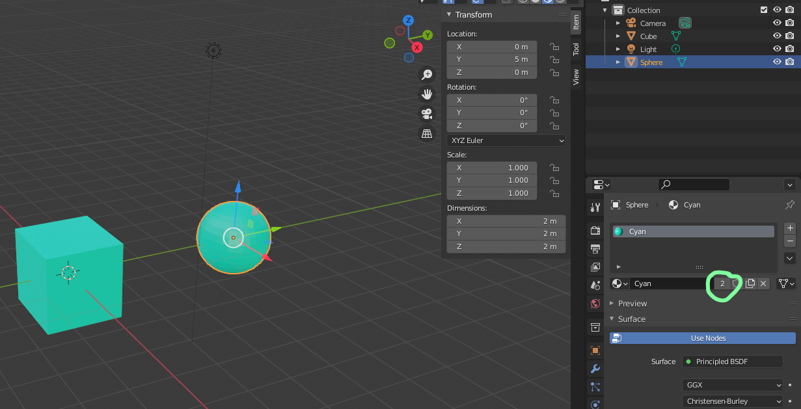
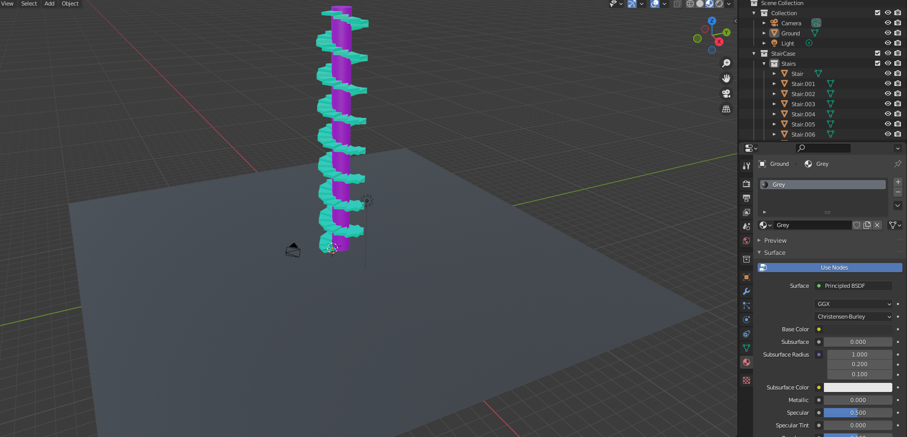

# DEV-03, Your first materials
#### Tags: [Materials]

## Modes

    There are what we call modes in blender. What we have been working with is called solid mode, and in it you may have difficulty seeing colors

The three modes are:

    Wire frame mode

    Solid Mode

    LookDev

    Rendered

    We will be working within LookDev for now

## Creating our first Material

    Also make sure use Nodes is turned on
    You can change color with Base Color

    It also tells you how much object are using that meterial

## Linking Materials

    Just make sure all you stuff is with a collection, much easier this way

