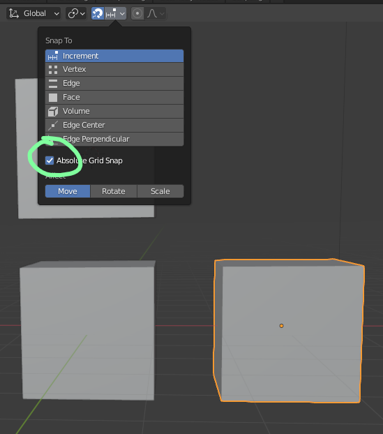
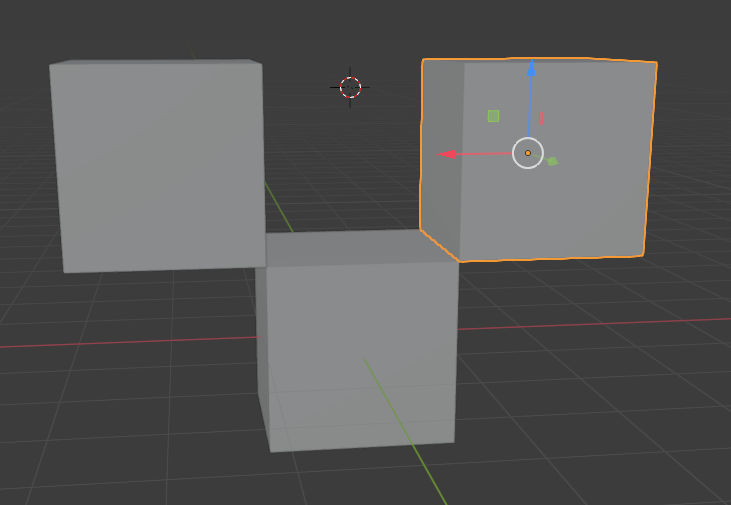

# DEV-04, Snapping
#### Tags: [snap]

# Snapping

Use Shift + Tab to toggle snapping

    if you zoom out enough, it will be able to snap to exactly one blender unit

    if you wan it to snap by whole numbers no matter what

    Vertex snapping tends to be the most commonly used
    in order to vertex snap, while holding the new shape, make sure the cursor is over the vertex you wish to snap.

