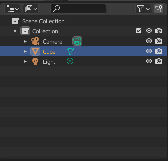
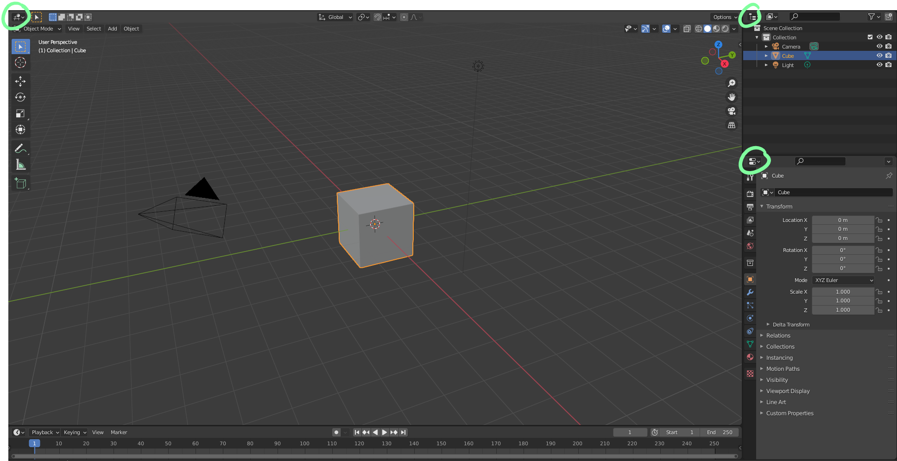
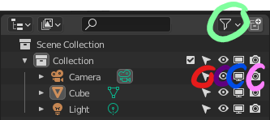

# DEV-07, The Outliner
#### Tags: [Outliner]

## The OutLiner

    The window type can be changed via here (circled)

    Add additional icons with the filter icon (circle with cyan)
    The cursor when deselected, it prevents the object from being selected (circle with red). This is really useful for object dense scenes that are not yet grouped into collections
    The eye hides things from view (circle with purple)
    The screen is a gloabal hide from all viewports (circle with blue)
    The camera prevents the object from being rendered (circle with pink)

