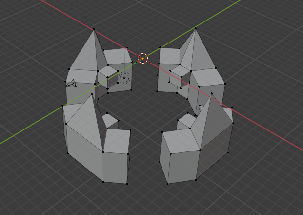
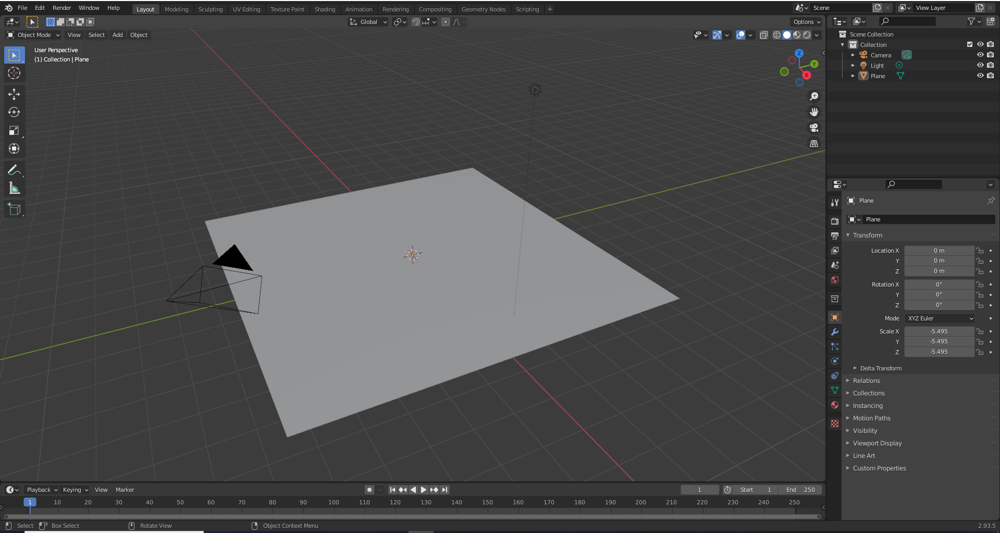
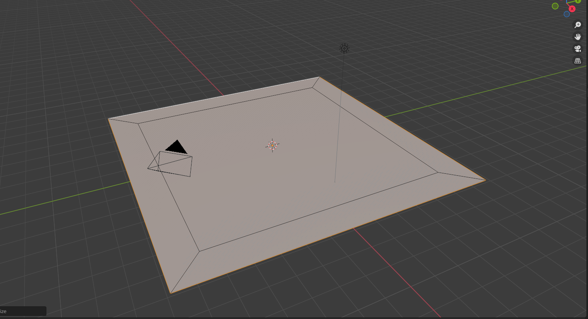
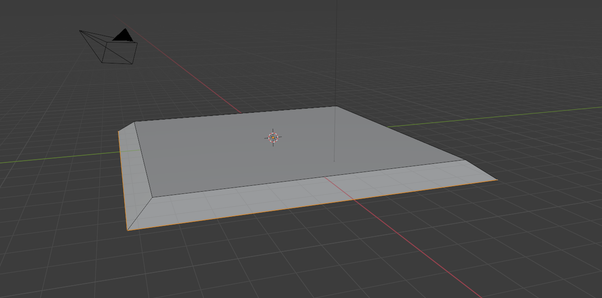

# DEV-12, Extruding
#### Tags: [Extruding]

## Extruding

    Press E to extrude a vertext, face or edge
    Remember to press f to fill after selecting vertexes

## Technique

    first start out with a regular plane

    One the edges only, press E to extrude and just immediately press enter with no visible extruding. then immediately scale with S

    You can then move it down using G

