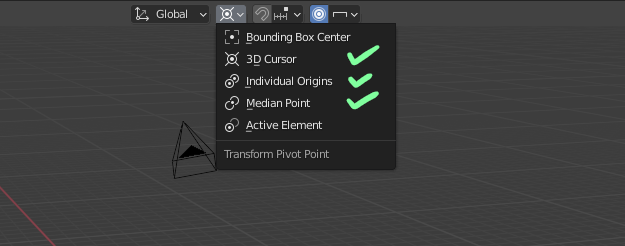
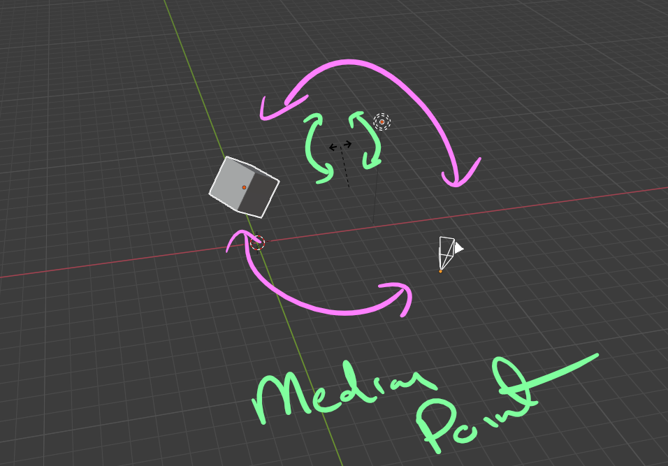
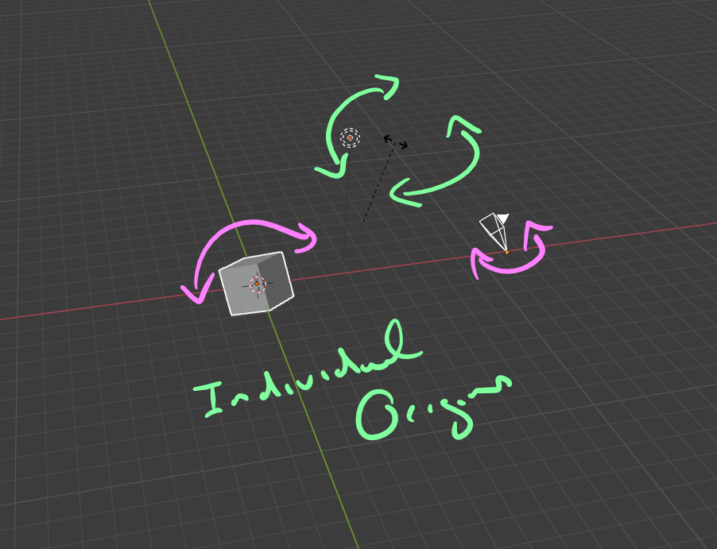
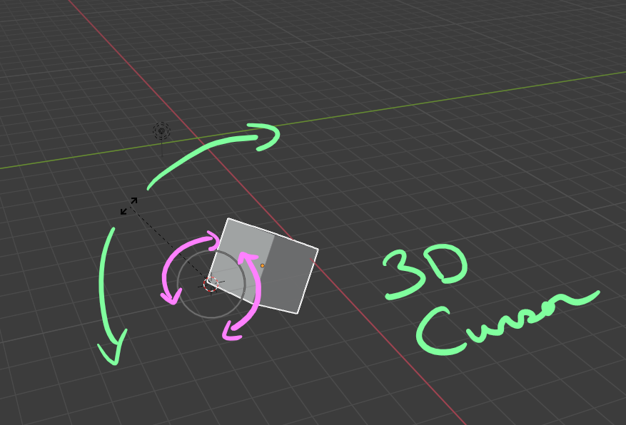
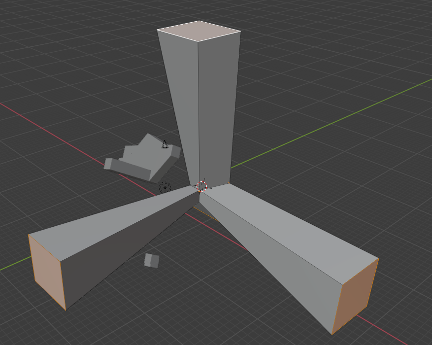
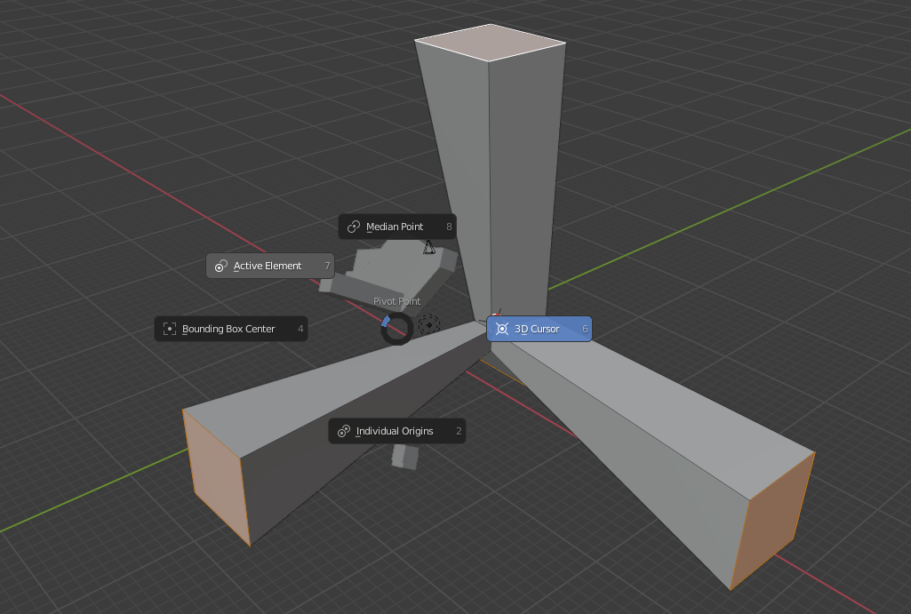
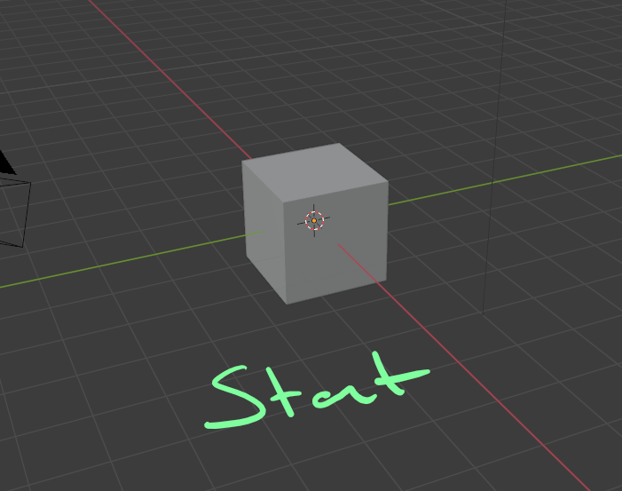
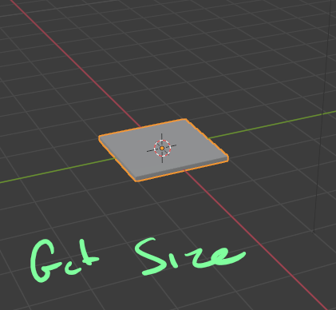
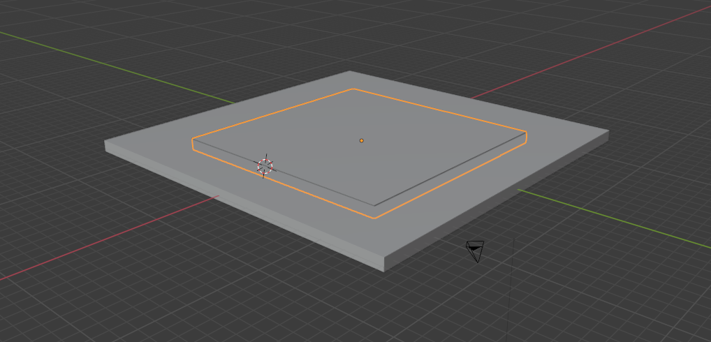
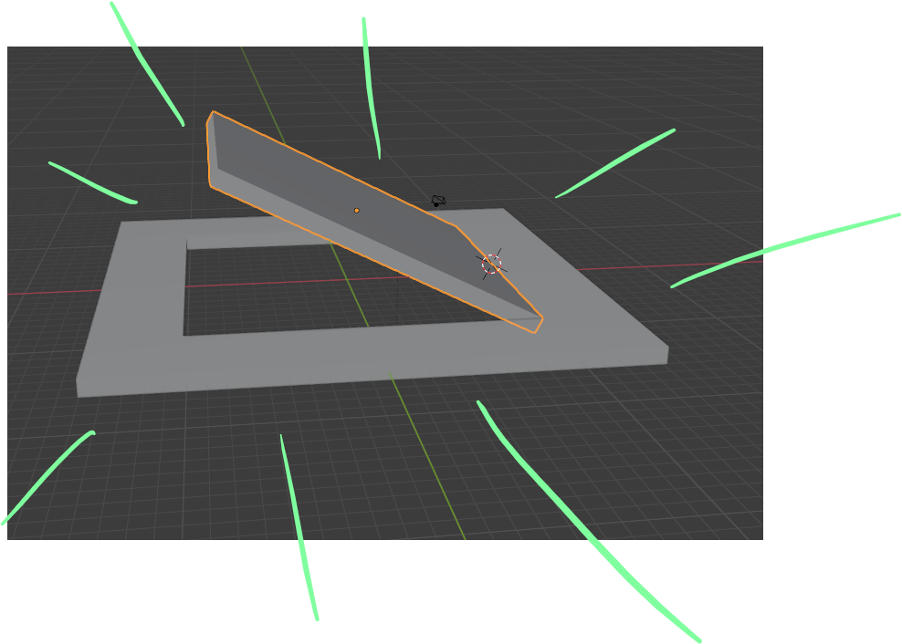

# DEV-13, Pivot Points
#### Tags: [Pivot points, median, individual origin, 3d cursor]

## Pivoting

    By default, when you go ahead and you rotate an object, it will rotate around its origin
    The median point is the average point of all of these objects

    Individual origin

    The 3d cursor

    Pressing . will bring up this menu

## Step by step

    s key
    z key
    .05

    Allow grid snapping
    Add absolute grid snap (DEV-04)
    Make side pieces

    i couldnt screen shot everything but what i did was make the flattened cube much larger (10x) and then extruded the flattened cube and then joined some vertexs and then hollowed out the center, then added a new cube and flattened it and placed it in the center

    Then I put the 3d cursor on the edge and rotated along the y axis of the 3d cursor

