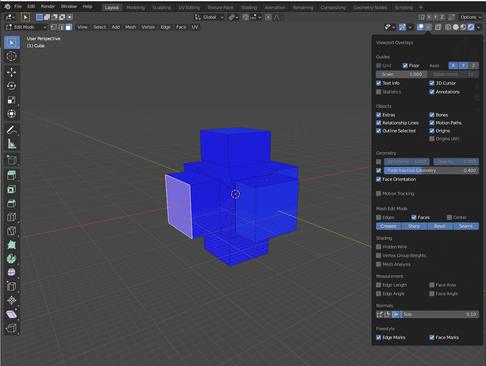
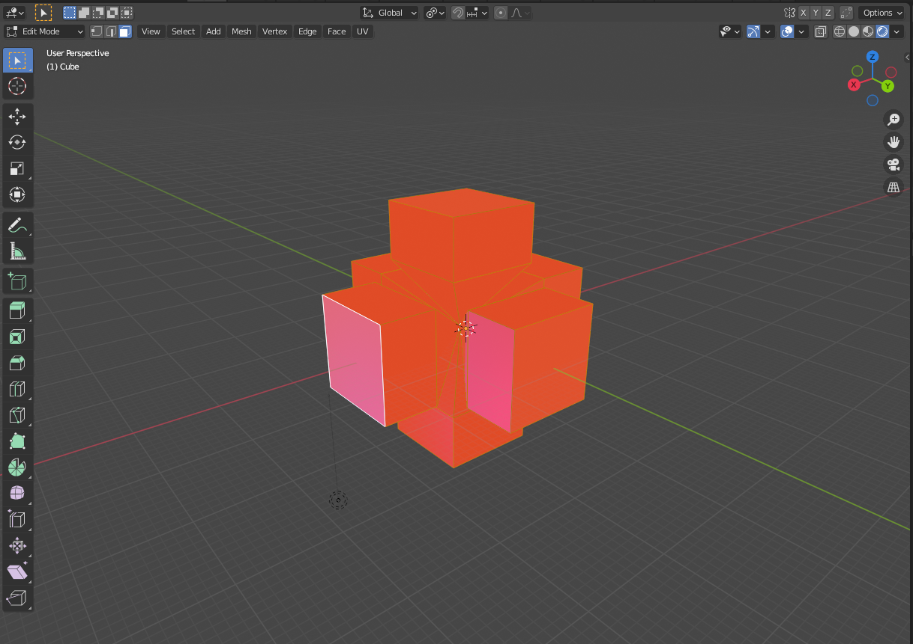
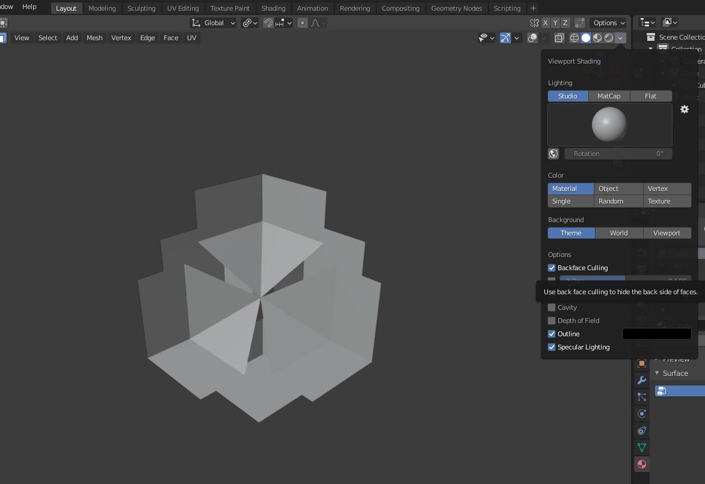
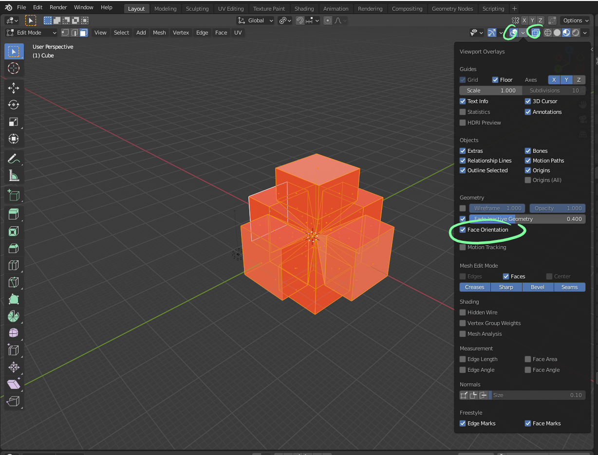

# DEV-15, Normals
#### Tags: [normals]

## Normals

+ Blue is good, blue means things are facing outward, and therefore visible

+ Orange is bad, our shape is actually inside out

+ Reality of how messed up it got 

+ How to enable and disable

+ You can fix normals with highlighting your object and pressing shift + n
+ Sometimes you will have to fix it manually
