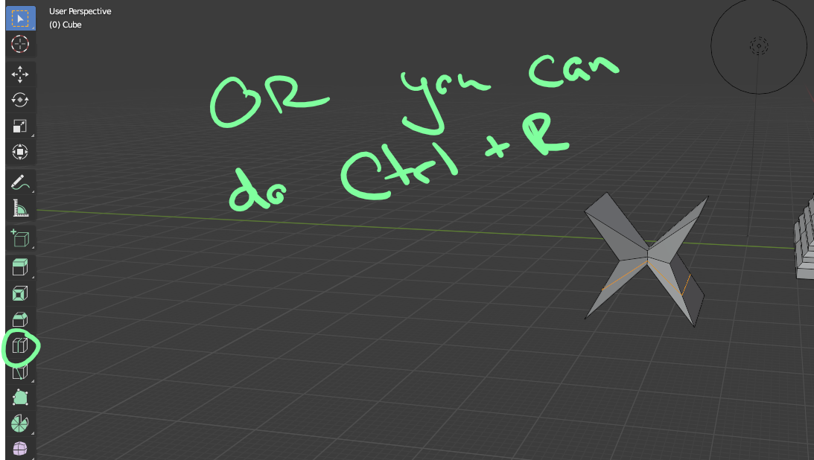
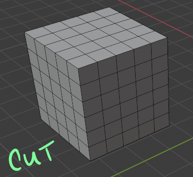
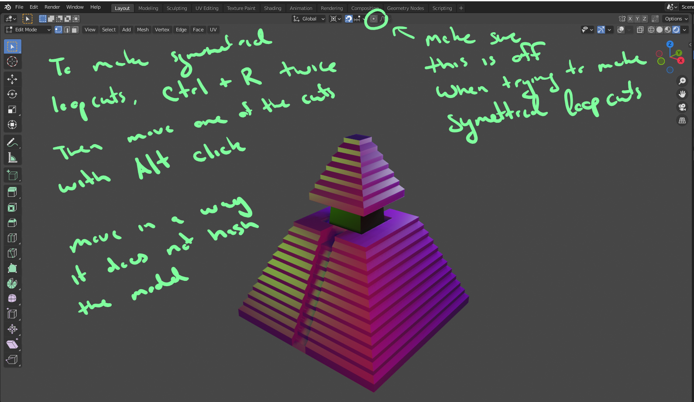
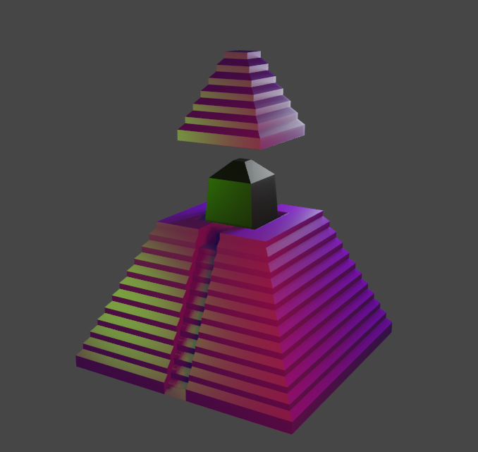

# DEV-17, Edge, Loops, Loop Cut and Slide
#### Tags: [loop cut, Symmetrical cuts]

## Blender

    to loop cut, you can also do ctrl + R
    you can also use the scroll wheel to add more cuts

    You can dissolve the edges you make by selecting them with alt then click the edge

## Symmetrical cuts

    To make symmetrical loop cuts, do Ctrl + R. Make sure this cut is running down the center

    Then Make a second cut ewith Ctrl + R. Then drag that cut to the center where the first cut was made.

    Then select one of those cuts with alt click.

    Then translate it with G + ( a direction like X, Y or Z) + a factor (type a number)
    Move in the direction that does not push into the geometry. likely the prefered direction is negative.

    Also refer to te picture to make sure a certain button is not selected. it will mees up your whole ability to do all of this

