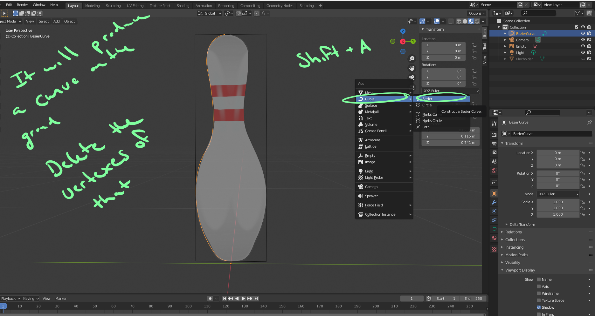
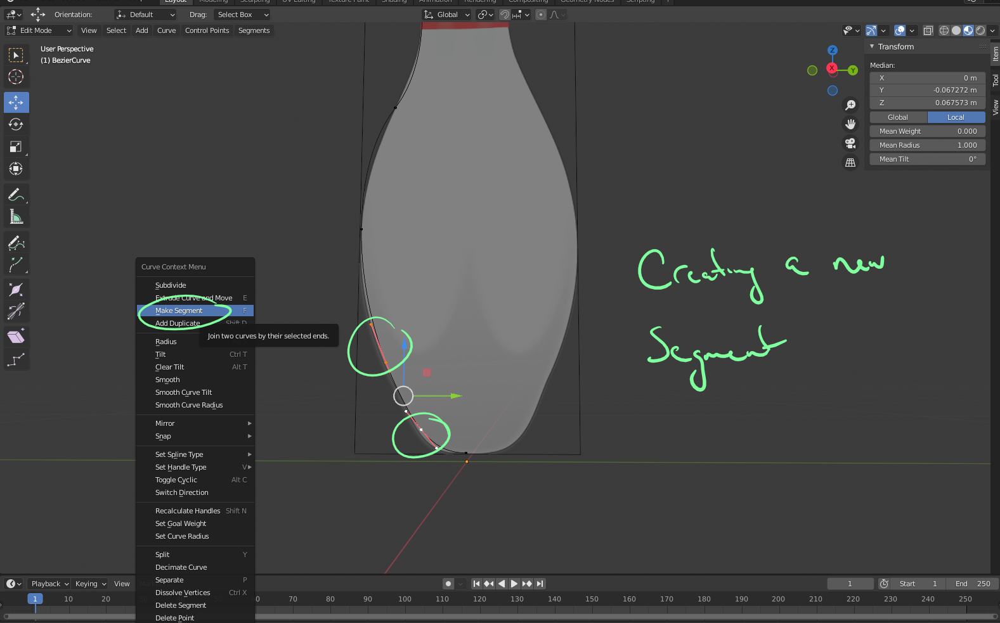
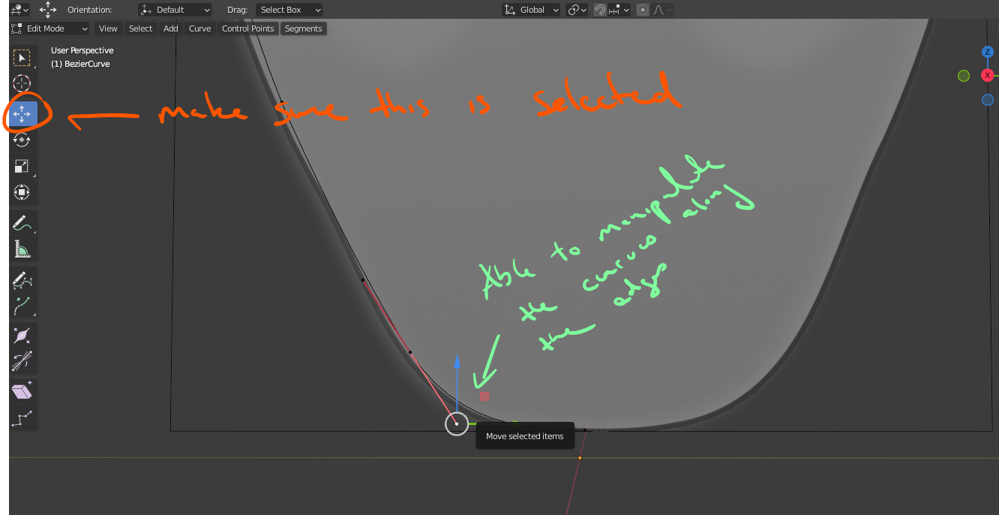

# DEV-25, Introduction to Bezier Curves
#### Tags: [Curves, Draw]

    
    Modify your Curve with B.
    Add new vertexes if you need finer tuning

    Also make sure that your curves are all along the same plane. They can sometimes lift off it
    For camera woes, remember to hold shift to adjust camera while holding the wheel

    You can have even greater control of the curve via this way