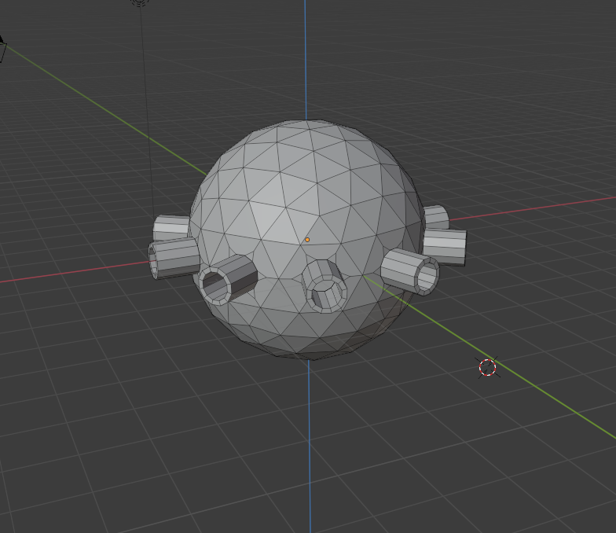
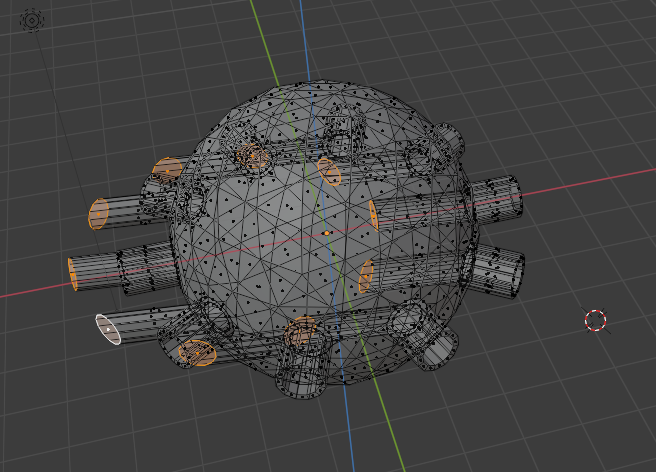
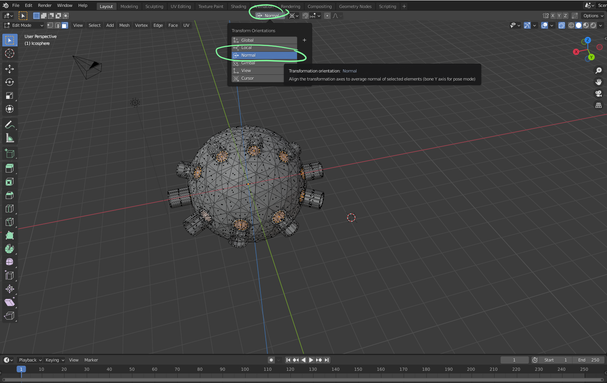
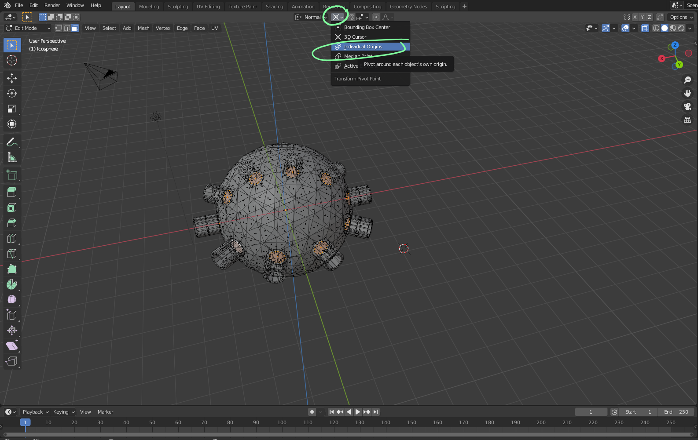

# DEV-31, Extude to normal
#### Tags: [extrude, Transform Origins, Transform Pivot Point]

     Starting Shape

    Currently, if we were to attempt to extrude to the center, they would all veer in one direction which is not what we want, for example:

    Crummy as hell. Instead, under Transform Origins select Normal

    And under Transform Pivot Point, select indiviual orgins

