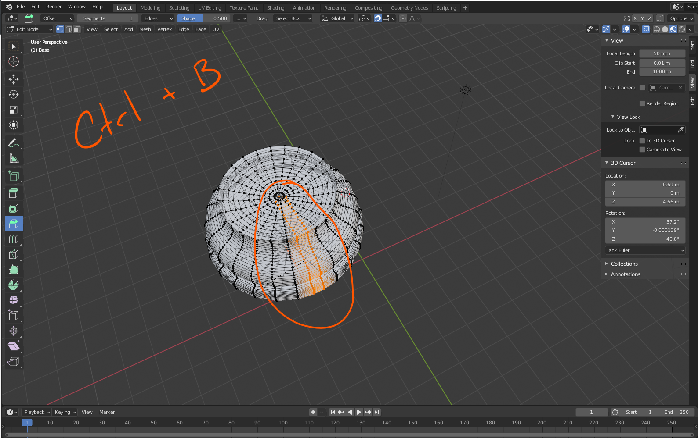

# DEV-36, Using the Bevel Tool
#### Tags: [Bevel Tool]

    using Ctrl B will allow you to split the vertices in two in a way, allowing for more geometry. holkd shift to roll in more verticies.

    Sharp edges are a great place to use this on, making them more curved. one thing thats handy is adding a loop cut (Ctrl + R) then using this