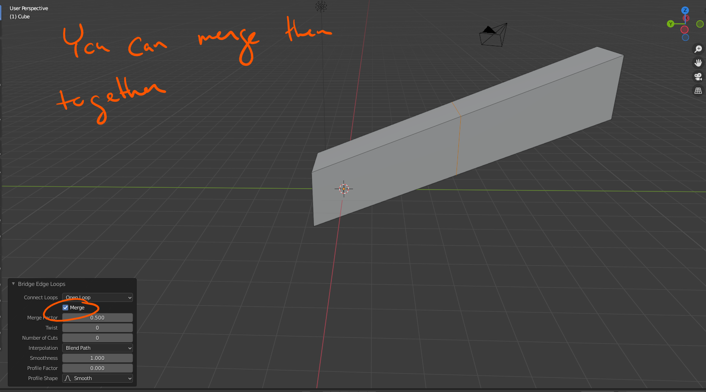
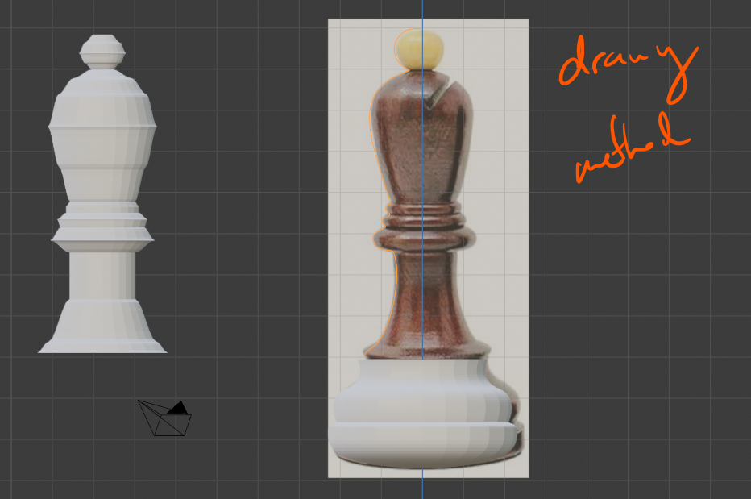

# DEV-38, Bridging Edge Loops
#### Tags: [Edge Loops, joining, bulging, holes, manifold objects]

## Bridging Edge Loops

    Bridgin Edge loops is an Edit operation. We can select a series of edges we want to join together

    Intersecting Geometry would fail in a 3D printer, its a non mainifold object, It has bits inside of itself. You also may not be able to do certain physics calculations or particle effects

## Intersecting Geometry

    When you are bridging edge loops you need to have a similar set of edges to bridge

## Making the Bishop

    Version 1

    Version 2

