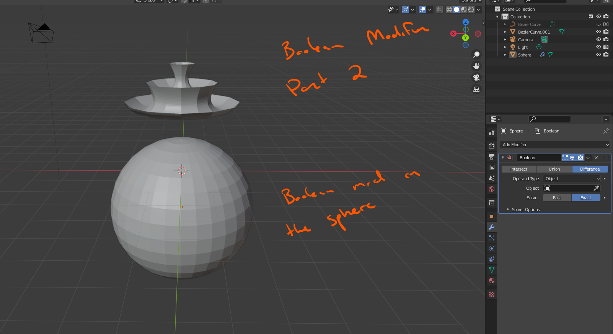
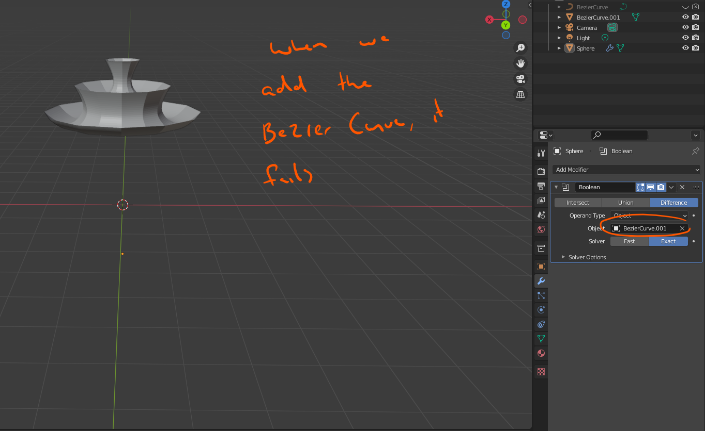
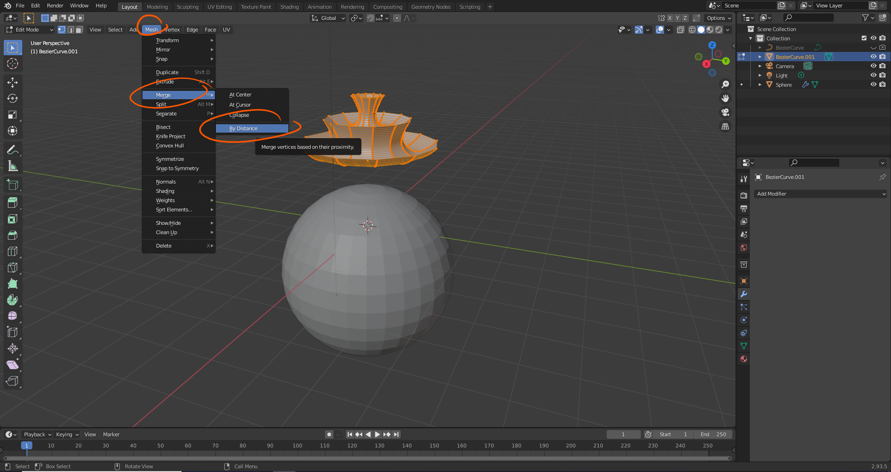
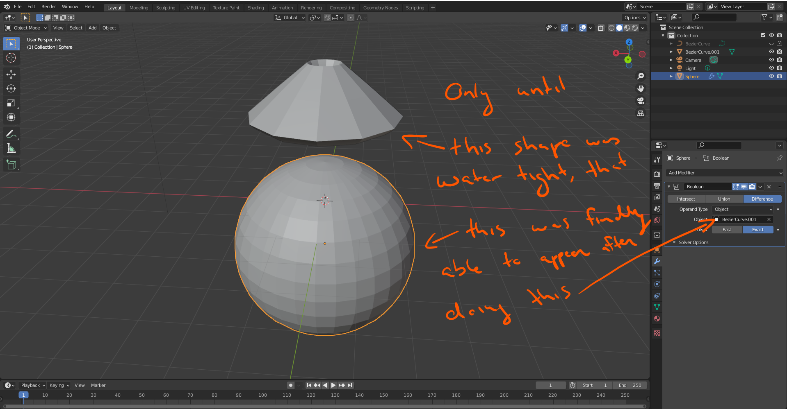
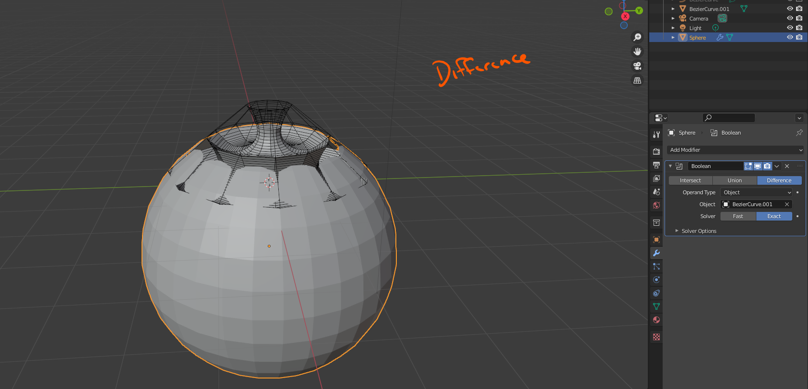
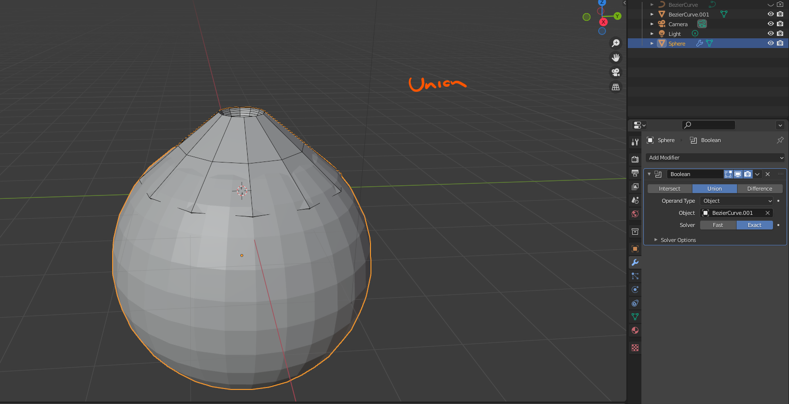
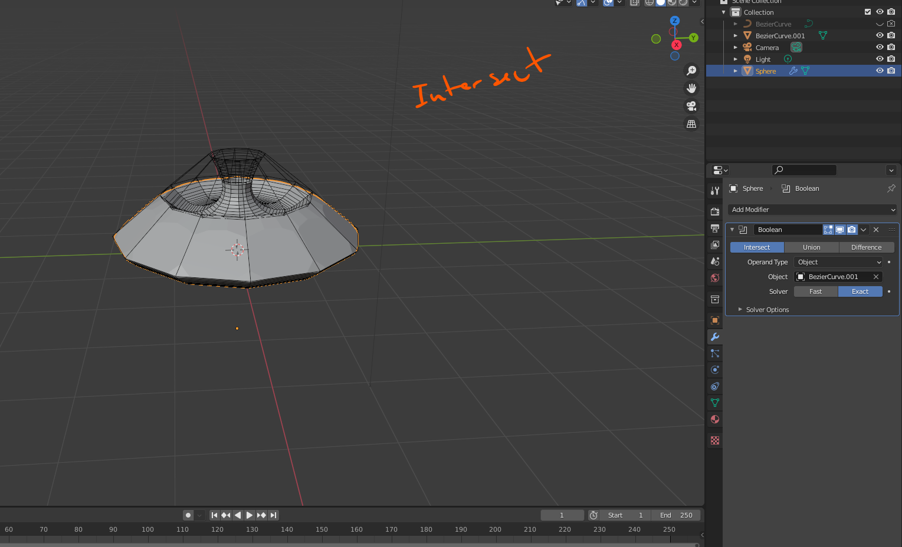

# DEV-41, Boolean Modifier Research
#### Tags: [Boolean Modifier, remove doubles, merge by distance, draw, spin]

## Research

    The reason the boolean operation fails is because you have duplicated geometry. Enter edit mode, press A to select All and clcik on mesh and select merge by distance.

    Using merge by distance, you can easily collapse the dublicate vertices into singles. always do this if you draw a shape

    Difference

    Union

    Intersect

