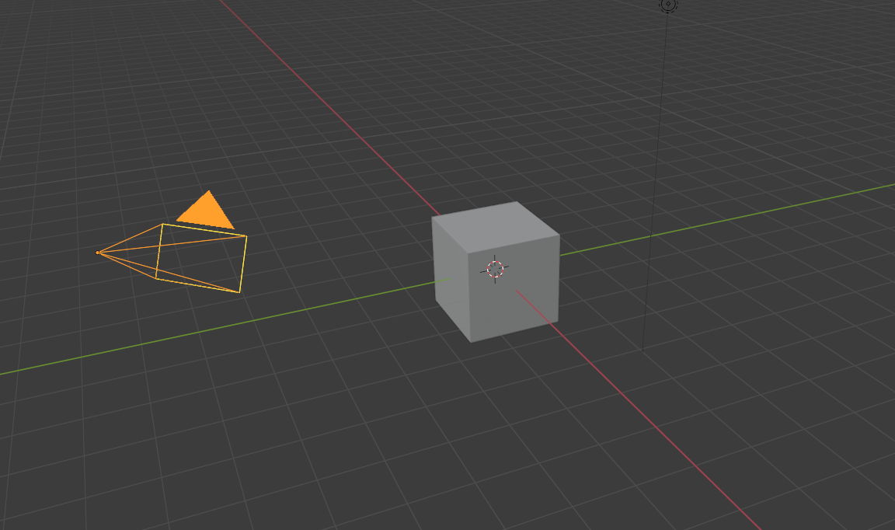
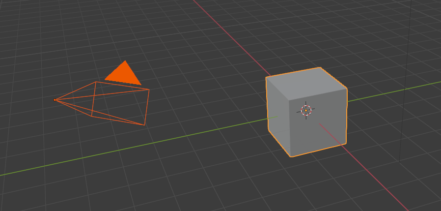
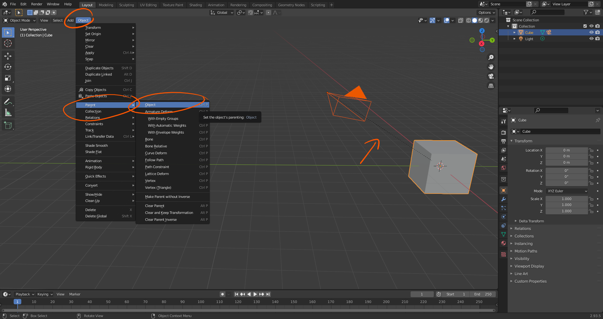
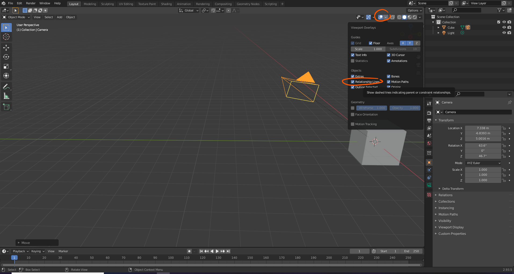
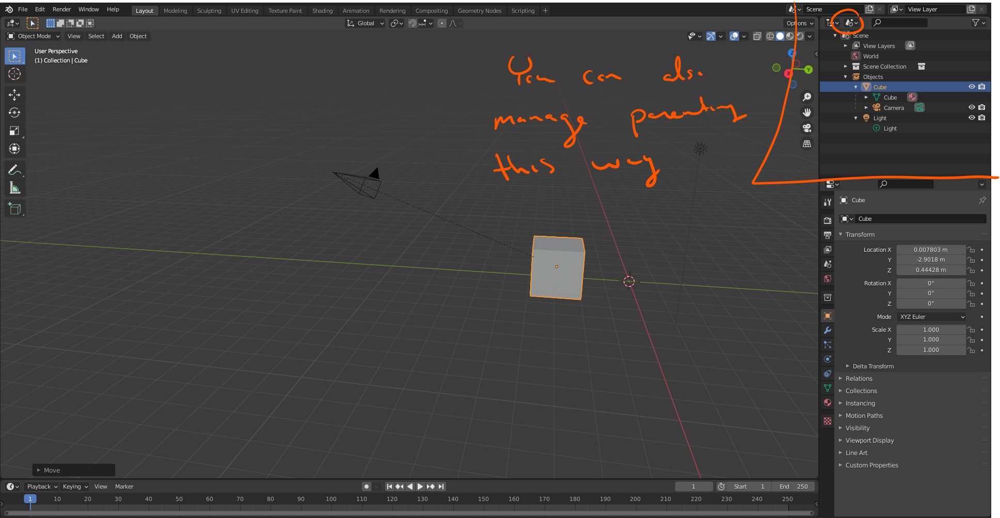
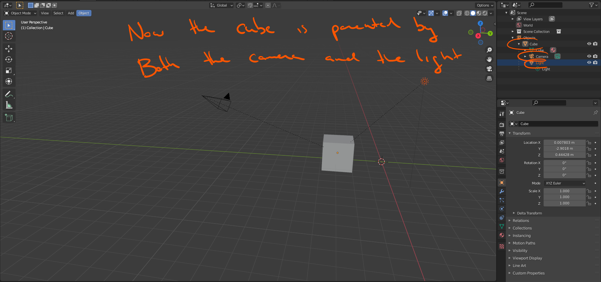
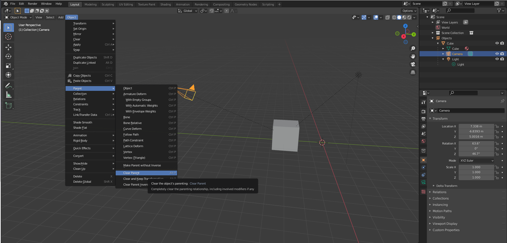

# DEV-42, Parent and Children
#### Tags: [Parenting objects]

# Research
    If you select the camera here

    and then select the cube while the camera is still selected

   
   
    The dark orange means that it is selected but is not the active item. you can also parent with CTRL + P. You can also parent multiple things to one object as well

  

    You can turn these off visually here

    Why this is nice is that if we move the cube around, the camera will follow it, like a parent. But if we move the camera around it moves freely

    This is useful for whenever there is a hierarchy of objects to work with

  

  

  

    If you choose to not parent things anymore, you have the option to clear parent

  

    This can also be done with ALT + P to bring up the menu