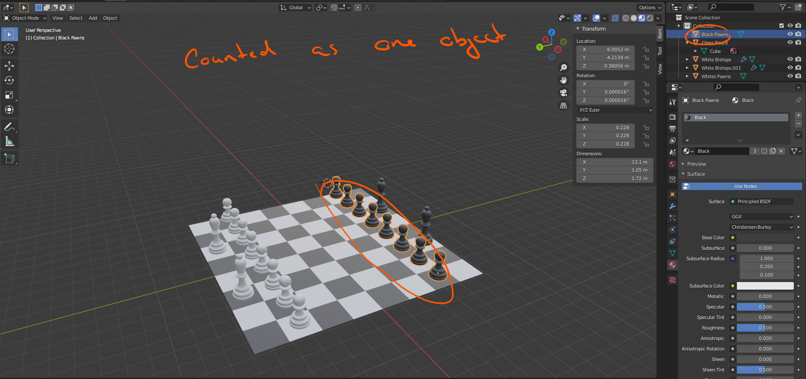

# DEV-43, Loose Parts
#### Tags: [Loose Parts, Separate objects]

    If you have multiple similar objectsthat you have created via array modifier or so, there is a way to separate them into their own object. For example, this is our starting object:

    Go into edit mode and select all with key A then press the key P.

    Separated
    
