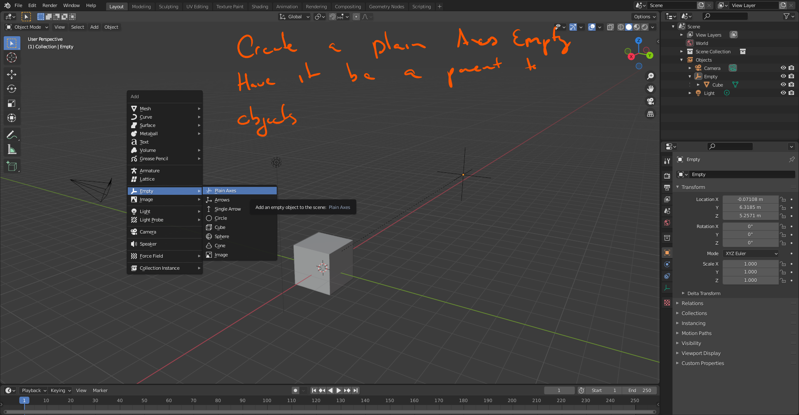

# DEV-44, Empties
#### Tags: [Empties]

    Empties are null objects, and thery have no geometry. It is mainly used for control and organization and can be used in modifiers

    It can be used as a parent object for a group of objects

    Empties are quite useful when combined with parenting. If you parent a bunch of cubes in this case to an empty and try to rotate:

