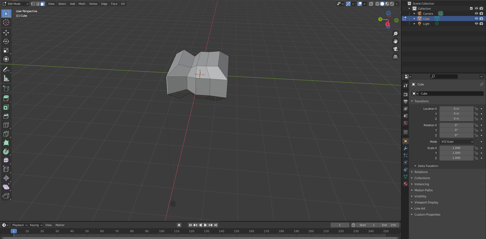
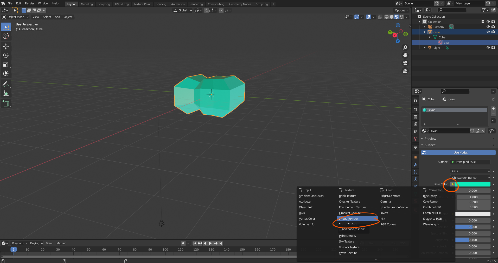
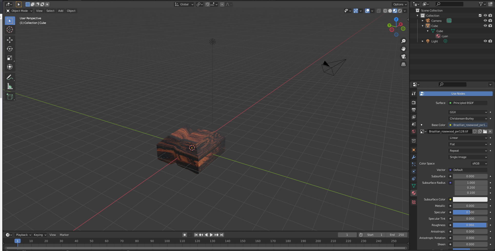
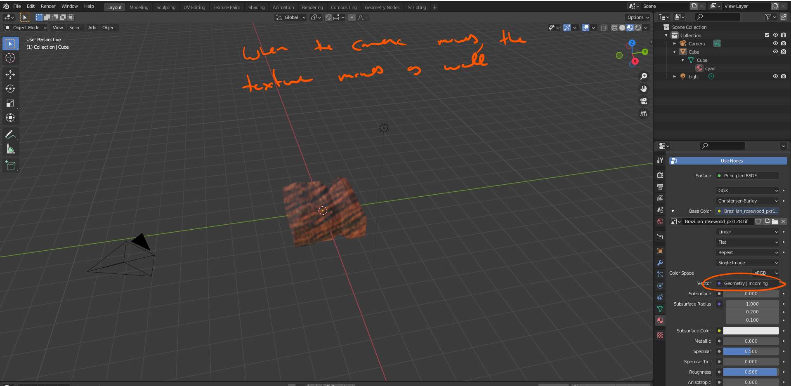
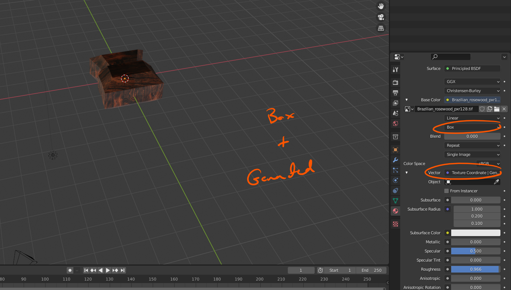
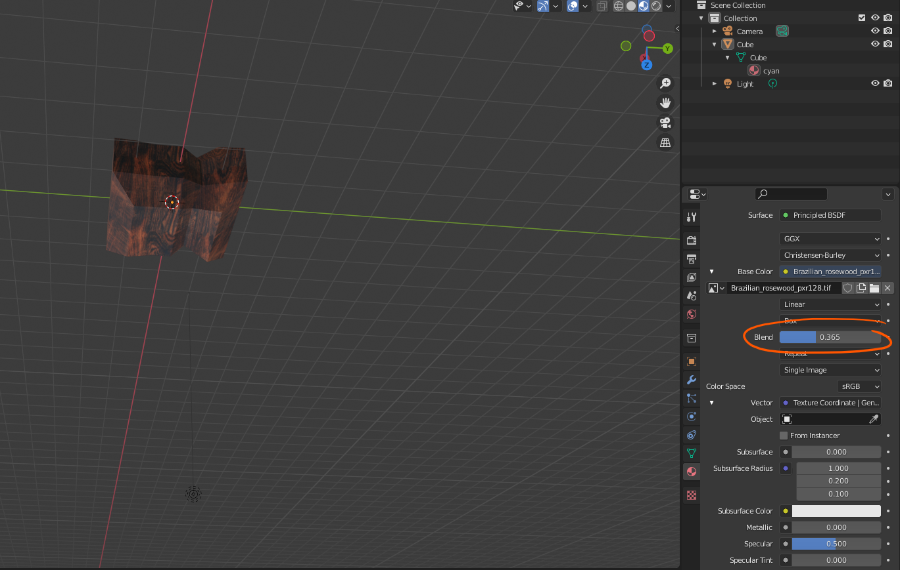

# DEV-47, Hiding unneeded Objects and Textures
#### Tags: [hiding, Textures]

    You can hide objects with the h key

    There are some cool options under the Vector option

    Generated and Object are two types that we can play with for now tho

    You can also add some blend to the object for the textures to transistion more smoothly

